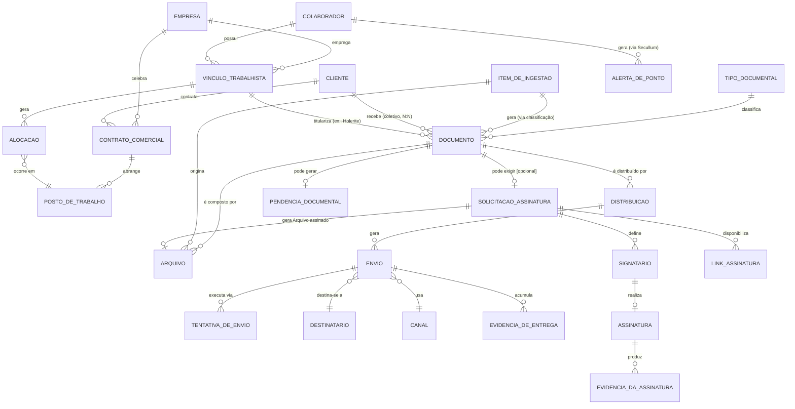

# Magnata OS — Modelo Canônico de Entidades

**Versão:** 1.0
**Status:** CANÔNICO INICIAL
**Data de consolidação:** 2026-07-22
**Fonte das decisões:** `MAGNATA_OS_DECISOES_ENTIDADES.md` — **26 das 29**
decisões da faixa `DEC-ENT-001` a `DEC-ENT-029` estão marcadas `APROVADA`
(Direção da Magnata, 2026-07-22), mais os quatro modelos conceituais
registrados naquele documento ("Modelo Conceitual Aprovado", "Modelo
Conceitual Documental", "Modelo Conceitual de Distribuição e Entrega",
"Modelo Conceitual de Assinatura"). As 3 exceções — `DEC-ENT-010`,
`DEC-ENT-011`, `DEC-ENT-012` — seguem `PENDENTE` e **não** foram incorporadas
como resolvidas; aparecem à parte, na §12.
**Escopo:** modelo canônico de entidades para orientar todo módulo novo do
Magnata OS, e referência para uma futura revisão de `MAGNATA_OS_ARQUITETURA.md`,
além de insumo direto para `MAGNATA_OS_EVENTOS.md` e
`MAGNATA_OS_CAPACIDADES.md` (ainda não criados).
**Limitações:** o diagnóstico do legado (glossário, mapa de tabelas,
problemas estruturais) foi produzido por leitura de código em 2026-07-22 e
não foi reverificado nesta consolidação — permanece válido como retrato
daquele momento, preservado nas §§3-4 e §10. Onde uma decisão aprovada ainda
não tem contrapartida técnica no legado, isso é dito explicitamente, não
presumido.

**Registrado expressamente:**
- Este modelo é **canônico para novos módulos** — toda implementação nova
  deve segui-lo.
- O **sistema legado ainda pode divergir** deste modelo durante toda a
  migração — divergência não é erro a corrigir às pressas, é o estado
  esperado de um sistema em transição.
- Divergências entre legado e modelo canônico são tratadas por
  **compatibilidade e plano de migração** (`MAGNATA_OS_ARQUITETURA.md` §7,
  strangler pattern), nunca por correção não planejada "já que estamos
  mexendo ali" (Manifesto, Relação com o sistema legado).
- **Este documento não autoriza, por si só, nenhuma alteração imediata de
  tabela do Airtable ou de código.** Nenhuma migração foi executada para
  produzi-lo.

---

## 1. Objetivo, escopo e natureza deste documento

Este documento responde, de forma canônica, à pergunta que orientou o
diagnóstico original: **o que é uma "coisa" no Magnata OS, de verdade?** A
diferença frente à v1 (diagnóstico) é que agora a resposta não é mais só uma
proposta em aberto — é o resultado consolidado de 29 decisões formais da
Direção da Magnata, registradas em `MAGNATA_OS_DECISOES_ENTIDADES.md`.

Isso muda o papel do documento: onde a v1 dizia "proposto, decisão
pendente", a v1.0 diz "aprovado, decisão de origem DEC-ENT-XXX" — e onde uma
pergunta genuinamente não foi respondida, isso continua dito com a mesma
honestidade da v1, não maquiado como resolvido.

**O que este documento não é:** não é uma ordem de serviço para alterar o
Airtable agora; não é a máquina de estados formal (essa é tarefa de
`MAGNATA_OS_ARQUITETURA.md` §5, a ser revisada à luz destas decisões); não é
o catálogo de eventos (`MAGNATA_OS_EVENTOS.md`, ainda não criado).

---

## 2. Regras de modelagem

Mantidas do diagnóstico original — continuam válidas e não foram alteradas
por nenhuma decisão aprovada:

| Natureza | Critério | Exemplo no sistema atual |
|---|---|---|
| **Entidade de negócio** | Existe independentemente do sistema; a empresa falaria dela numa conversa sem TI | Colaborador, Cliente, Documento |
| **Registro técnico** | Representação de uma entidade de negócio dentro de uma tabela específica — pode haver mais de um registro técnico para a mesma entidade | Uma linha em `Funcionários` (tabela) é o registro técnico de um Colaborador (entidade) |
| **Arquivo físico** | Bytes armazenados (PDF, anexo) — não é a entidade, é a evidência/representação dela | O PDF em `Arquivos.Attachments` |
| **Evento** | Algo que aconteceu, com timestamp, não editável depois (em teoria) | `DocumentoRecebido`, `EnvioRealizado` |
| **Estado** | Um valor de um campo `Status` que representa em que ponto do ciclo de vida uma entidade está | `Pendente`, `Concluído` |
| **Comando/ação** | Uma chamada que dispara comportamento — não é uma "coisa", é um verbo | `POST /processar-fila`, `_marcar_envio_status(...)` |
| **Integração externa** | Sistema fora da fronteira do Magnata OS que fornece ou recebe dado | Secullum, Evolution API, Gmail |

Regra central mantida: **uma tabela do Airtable não vira entidade de negócio
automaticamente.**

---

## 3. Situação atual do legado — Glossário

**Esta seção é diagnóstico, não modelo canônico.** Preservada integralmente
da v1, sem reescrever o passado como se o legado já obedecesse ao modelo
novo. Onde uma decisão aprovada resolveu a ambiguidade, isso é anotado na
coluna "Status da decisão" — mas o comportamento do **código** não mudou.

| Termo | Onde aparece | Significado aparente | Ambiguidade | Status da decisão |
|---|---|---|---|---|
| `Funcionários` (tabela) | `app.py:82` `TABLE_FUNC` | Pessoa + vínculo empregatício + cargo + status, tudo num registro | Mistura 3 conceitos num só registro | **Resolvido como direção** (DEC-ENT-002): Colaborador × Vínculo Trabalhista × Alocação são entidades canônicas separadas — separação técnica ainda não feita no Airtable |
| `Tipo` (campo, Processar Arquivos) | `ARQUITETURA_FASE_2_DECISAO_FINAL.md`, `fldJWy7givUDs1aCl` | Categoria documental, estava ocioso | Competia com `Tipo de Documento` | Sem DEC-ENT dedicada; segue como Tipo Documental canônico (§5) |
| `Tipo de Documento` (campo, Processar Arquivos) | `app.py:439` `F_PROC_TIPO_DOC` | Tipo de documento **e também** código de erro técnico | Contaminado | **Ainda não resolvido tecnicamente** — débito conhecido (`MAGNATA_OS_ARQUITETURA.md` §8), sem DEC-ENT específica |
| `Arquivos` (tabela) | `app.py:113` `TABLE_ARQUIVOS` | Anexo físico + hash + link ao e-mail de origem | Só no nome, não no dado | **Resolvido como direção** (DEC-ENT-015, DEC-ENT-017): Arquivo canônico, com versão/vigência — atributos ainda não criados no Airtable |
| `Arquivos 2` (campo) | `app.py:438` `F_PROC_ARQUIVOS2` | Link de `Processar Arquivos` → `Arquivos` | Nome sugere segundo conjunto de anexos | Sem mudança — é referência relacional, não entidade |
| `Emails Savian` (tabela) | `app.py:112` | Origem do e-mail (Message ID, Assunto, Conteúdo) | Nome próprio sem relação com o domínio | Mantido como registro técnico de Item de Ingestão (§5) |
| `Processar Arquivos` (tabela) | `app.py:114` | Fila de entrada + resultado de classificação, no mesmo registro | Mistura duas fases do ciclo de vida | **Ainda não resolvido tecnicamente** — separação planejada em `ARQUITETURA_FASE_2_DECISAO_FINAL.md`, não executada |
| `Pendências/Revisar` (tabela) | `app.py:115`; `secullum_ponto.py:95` | Revisão de documento **e** alerta de ponto, na mesma tabela | Dois domínios sem relação, mesma tabela | **Resolvido como direção** (achado crítico #2; DEC-ENT-010 sobre a relação entre elas segue `PENDENTE`) — separação técnica não feita |
| `Locais` (tabela) | `app.py:118` | Posto de trabalho, vinculado a um Cliente | Nome genérico | Corresponde a Posto de Trabalho canônico (§5); DEC-ENT-003 proíbe multi-cliente |
| `Clientes` (tabela) | `app.py:119` | Empresa/condomínio contratante | "Condomínio" só em comentário, sem campo próprio | **Resolvido** (DEC-ENT-001): Condomínio vira Tipo de Cliente — atributo ainda não criado no Airtable |
| `Envios de Documentos` (tabela) | `app.py:120` | Fila de envio, mistura ciclo do envio com o de leitura | `Status` único mistura processo com evento | **Resolvido como direção** (DEC-ENT-009, DEC-ENT-013, DEC-ENT-020) — Distribuição/Envio/evidência ainda no mesmo registro técnico |
| `Status` (Processar Arquivos) recebendo `'Assinado'` | `app.py:9896` | Estado da Assinatura vazando para o Documento | **Achado crítico #1** | **Resolvido como regra de negócio** (DEC-ENT-022): `Assinado` deixa de ser estado válido de Documento — código ainda escreve esse valor hoje |
| `Status` (Envios) | `app.py:123, 10330` | `Preparando/Enviado/Concluído/Lido`, mais `'Erro'` no código | Comentário desatualizado frente ao código | **Resolvido como direção** (DEC-ENT-009, DEC-ENT-020) — vocabulário conceitual novo, não implementado |
| `Status` (Assinaturas) | `app.py:160` | `Pendente/Assinado/Expirado` | Colide com `Status` de Processar Arquivos | **Resolvido** (DEC-ENT-027, DEC-ENT-028) — vocabulário mais granular aprovado, não implementado |
| `Finalizado`, `Pronto` | não encontrados como literal em `app.py` | **[INFERÊNCIA]** possivelmente opção de `singleSelect` só no Airtable | Não verificável só pelo código | **Ainda `PENDENTE`** (DEC-ENT-012) — não confirmado nesta consolidação |
| `Kit Admissão` | `app.py:107-108, 2410-2796` | Agrupamento de documentos por janela de ±20s | Comportamento, não tabela própria | Corresponde ao padrão de Item de Ingestão → N Documentos (§5, Modelo Conceitual Documental) |
| `Fechamento` (`TABLE_FECH`) | `secullum_ponto.py:116` | Registro de fechamento de ponto por período | Sem contexto no nome | **Ainda `PENDENTE`** (DEC-ENT-011) |
| `SBJ` (`TABLE_SBJ`) | `secullum_ponto.py:135` | Relatório de dias sem batida — **[INFERÊNCIA]** | Sigla sem glossário | **Ainda `PENDENTE`** (DEC-ENT-011) |
| `Contrato` | Só como tipo de documento | Rótulo, não entidade com ciclo de vida | Sem entidade "Contrato Comercial" | **Resolvido como direção** (DEC-ENT-003): Contrato Comercial entra no modelo conceitual — sem tabela ainda |
| `Condomínio` | Só em comentário (`app.py:6796-6802`) | Sinônimo de negócio para Cliente | Sem campo próprio | **Resolvido** (DEC-ENT-001): vira Tipo de Cliente |

---

## 4. Situação atual do legado — Mapa de tabelas

**Diagnóstico preservado**, sem alteração desde a v1:

| Tabela (registro técnico) | ID Airtable | O que carrega hoje |
|---|---|---|
| Funcionários | `tblNd8G66kjwos3eP` | Pessoa + vínculo + cargo + status + documentos anexados |
| Holerites | `tblVaUgZeFfa5zRcH` | Um holerite individual por Funcionário/competência |
| Contabilidade Mensal | `tblWITpkSbPg4SBAR` | Agrupador de competência/folha mensal |
| Emails Savian | `tblljRRrraXSipJd1` | E-mail de origem |
| Arquivos | `tblRsvhz8oOcUqhkv` | Anexo físico + hash |
| Processar Arquivos | `tblXaLXvGJMyFOayc` | Item de ingestão + resultado de classificação |
| Pendências/Revisar | `tblRkJBL6Wwf4fxVC` | Revisão de documento **e** alerta de ponto |
| Locais | `tblZy1WfzmGIeR8ZP` | Posto de trabalho, vinculado a um Cliente |
| Clientes | `tbl0znyuCEzoCHtCV` | Cliente/condomínio contratante |
| Envios de Documentos | `tblAu4wgdfTgLOoa4` | Fila de envio + status de entrega + status de leitura |
| Extratos Mensais | `tblJCUcFBVTH5W2kP` | Documento coletivo por cliente |
| FGTS Digital | `tbl8ehgLa00cE1U3s` | Guia FGTS por cliente |
| Guias e Comprovantes | `tbl6FT1YzK1yqI77l` | Guias diversas e comprovantes |
| Assinaturas | `tbl6xgW45637YJISv` | Solicitação + evidência + status de assinatura nativa |
| Outros Documentos | `tblanxELlj11HjJEV` | Documento não classificado |
| Fechamento (Secullum) | `tblwWoc3xhpRujZ6i` | Fechamento de ponto por período |
| SBJ (Secullum) | `tbl9foza93kj0BdAI` | Relatório de dias sem batida |

Não encontrada no legado: tabela própria para Contrato Comercial, Vínculo
Trabalhista, Alocação, Distribuição (separada de Envio), Tentativa de Envio,
Destinatário, Canal (separado de provedor), Signatário, Link de Assinatura —
todos esses conceitos agora fazem parte do modelo canônico (§5) — a maioria
como entidade canônica definitiva, Canal como estrutura de valor — sem
contrapartida técnica ainda.

---

## 5. Modelo Canônico de Entidades

Esta seção descreve **26 conceitos**, organizados em 6 grupos. Nem todos são
entidades com identidade própria — a tabela abaixo é a **contagem oficial**
deste documento, com nomenclatura inequívoca, para que nenhuma outra menção a
quantidade em qualquer outra seção precise ser interpretada:

| Classificação | Quantidade | Conceitos |
|---|---|---|
| **Entidade canônica definitiva** | 20 | Empresa, Cliente, Contrato Comercial, Posto de Trabalho, Colaborador, Vínculo Trabalhista, Alocação, Documento, Arquivo, Item de Ingestão, Distribuição, Envio, Tentativa de Envio, Destinatário, Solicitação de Assinatura, Signatário, Assinatura, Link de Assinatura, Pendência Documental, Alerta de Ponto |
| **Entidade candidata / registro imutável candidato** (decisão técnica final ainda não tomada) | 2 | Evidência de Entrega (DEC-ENT-009, DEC-ENT-021), Evidência da Assinatura (DEC-ENT-025) |
| **Estrutura de valor** (vocabulário fechado ou atributo estruturado, sem identidade própria nem tabela de registros) | 3 | Tipo Documental, Competência, Canal |
| **Especialização de entidade** (caso concreto de outra entidade — não conta como tipo à parte) | 1 | Arquivo Assinado (é um Arquivo, DEC-ENT-026) |
| **Total de conceitos descritos nesta seção** | **26** | — |

Cada conceito abaixo repete sua classificação entre parênteses no próprio
cabeçalho, quando não for "Entidade canônica definitiva" (esse caso fica
implícito por omissão de rótulo, para não poluir os 20 títulos majoritários).

### GRUPO: Estrutura empresarial

#### Empresa

**Definição oficial:** a Magnata Portaria e Serviços LTDA — a organização que
opera o Magnata OS e emprega os Colaboradores.
**Responsabilidade:** ser o empregador de referência; origem de todo Vínculo
Trabalhista.
**Não representa:** um Cliente (a Magnata nunca é cliente de si mesma —
excluída explicitamente do casamento de CNPJ em documentos coletivos).
**Identificador canônico proposto:** CNPJ.
**Identificadores legados encontrados:** nenhuma tabela própria — só a
constante `CNPJ_MAGNATA` (`app.py:369`) e rodapés de PDF (`app.py:2591, 8928`).
**Atributos mínimos conceituais:** Razão Social, CNPJ, endereço.
**Relacionamentos:** 1 Empresa → N Vínculos Trabalhistas; 1 Empresa → N
Contratos Comerciais.
**Ciclo de vida:** nenhum — entidade singular e estável.
**Estados conceituais aprovados:** nenhum.
**Eventos candidatos:** nenhum proposto.
**Origem atual dos dados:** hardcoded no código, não modelada como registro.
**Diferenças em relação ao legado:** o legado não modela Empresa — é uma
constante de exclusão. O canônico a formaliza como âncora de Vínculo e
Contrato Comercial.
**Riscos de migração:** baixo — entidade singular, sem dado a migrar.
**Decisões de origem:** implícita em DEC-ENT-002, DEC-ENT-003, DEC-ENT-016
(Modelo Conceitual Aprovado).

#### Cliente

**Definição oficial:** organização contratante da Magnata — pode ser
condomínio, empresa, indústria, hospital, escola, loteamento, associação,
órgão público, entre outros tipos.
**Responsabilidade:** destinatário institucional de documentos coletivos;
agrupador de Contratos Comerciais e, por meio deles, de Postos de Trabalho.
**Não representa:** Condomínio como entidade separada (é um Tipo de Cliente);
um Posto de Trabalho (um Cliente pode ter vários).
**Identificador canônico proposto:** CNPJ (ou CPF, pessoa física) +
identificador interno estável.
**Identificadores legados encontrados:** Airtable Record ID de `Clientes`;
CNPJ; nome/razão social como fallback.
**Atributos mínimos conceituais:** Nome/Razão Social, CNPJ, **Tipo de
Cliente** (condomínio, empresa, indústria, hospital, escola, loteamento,
associação, órgão público, outro), indicadores de política.
**Relacionamentos:** 1 Cliente → N Contratos Comerciais; 1 Contrato → N
Postos de Trabalho; 1 Cliente → N Documentos coletivos; 1 Cliente → N
Distribuições.
**Ciclo de vida:** nenhum estado formalmente aprovado.
**Estados conceituais aprovados:** nenhum.
**Eventos candidatos:** `ClienteCadastrado` — proposto.
**Origem atual dos dados:** Airtable (`Clientes`), cadastro manual.
**Diferenças em relação ao legado:** o legado trata Cliente e Condomínio
como idênticos, sem atributo de tipo, e sem Contrato Comercial entre Cliente
e Posto.
**Riscos de migração:** baixo — só adição de atributo `Tipo` e criação
futura de Contrato Comercial.
**Decisões de origem:** DEC-ENT-001, DEC-ENT-003.

#### Contrato Comercial

**Definição oficial:** o acordo comercial entre a Magnata e um Cliente que
autoriza e enquadra a prestação de serviço num ou mais Postos de Trabalho.
**Responsabilidade:** vínculo formal entre Cliente e Posto de Trabalho;
suporte futuro de regras contratuais (rateio, condições, vigência).
**Não representa:** o Cliente em si; o Posto de Trabalho em si.
**Identificador canônico proposto:** identificador interno estável —
**[INFERÊNCIA]**, sem número de contrato hoje mapeado.
**Identificadores legados encontrados:** nenhum.
**Atributos mínimos conceituais:** Cliente (relação), vigência, Postos de
Trabalho abrangidos.
**Relacionamentos:** 1 Cliente → N Contratos; 1 Contrato → N Postos.
**Ciclo de vida:** **[INFERÊNCIA]** Ativo/Encerrado, não decidido.
**Estados conceituais aprovados:** nenhum.
**Eventos candidatos:** nenhum proposto.
**Origem atual dos dados:** nenhuma — ausente do sistema atual.
**Diferenças em relação ao legado:** o legado não tem esta entidade —
`Locais.Cliente` liga Posto direto a Cliente, sem intermediário.
**Riscos de migração:** médio — a decisão já prevê isso como "futuramente",
não bloqueia a primeira migração.
**Decisões de origem:** DEC-ENT-003 (Modelo Conceitual Aprovado).

#### Posto de Trabalho

**Definição oficial:** posição ou necessidade operacional prevista (ex.:
Portaria Principal, Portaria de Serviço, Limpeza, Zeladoria, Ronda,
Controlador de Acesso Diurno/Noturno) — não uma pessoa.
**Responsabilidade:** agrupar necessidade de trabalho por local/turno; ser
destino de Alocações.
**Não representa:** o Cliente; o Colaborador que ocupa o posto num momento
(isso é a Alocação).
**Identificador canônico proposto:** identificador interno estável +
nome/código do posto.
**Identificadores legados encontrados:** Airtable Record ID de `Locais`;
link para `Clientes`.
**Atributos mínimos conceituais:** Nome, Cliente (ou, futuramente, Contrato
Comercial), regras de intervalo/turno.
**Relacionamentos:** N Postos → 1 Contrato Comercial (futuramente) / 1
Cliente (hoje); 1 Posto → N Alocações. **Nunca pertence a mais de um Cliente
simultaneamente.**
**Ciclo de vida:** nenhum identificado.
**Estados conceituais aprovados:** nenhum.
**Eventos candidatos:** nenhum proposto.
**Origem atual dos dados:** Airtable (`Locais`).
**Diferenças em relação ao legado:** o legado já modela 1:N Cliente→Posto
corretamente; a diferença é a proibição explícita de Posto multi-cliente —
rateio passa a ser resolvido via Alocação.
**Riscos de migração:** baixo.
**Decisões de origem:** DEC-ENT-002, DEC-ENT-003, DEC-ENT-006 (Modelo
Conceitual Aprovado).

### GRUPO: Pessoas e relações profissionais

#### Colaborador

**Definição oficial:** a pessoa no contexto profissional da Magnata —
identidade permanente que atravessa qualquer número de Vínculos Trabalhistas
ao longo do tempo.
**Responsabilidade:** identidade única de quem pode ter um ou mais Vínculos.
**Não representa:** o Vínculo Trabalhista (datas, cargo, salário, regime,
matrícula pertencem ao Vínculo); o Posto de Trabalho; um Destinatário
genérico (frequentemente coincide, mas são conceitos diferentes).
**Identificador canônico proposto:** CPF + identificador interno estável.
**Identificadores legados encontrados:** Airtable Record ID de
`Funcionários`; CPF; nome completo como fallback (frágil).
**Atributos mínimos conceituais:** Nome completo, CPF.
**Relacionamentos:** 1 Colaborador → N Vínculos (normalmente 1 ativo por
vez); 1 Colaborador → N Documentos individuais; 1 Colaborador → N
Assinaturas (como Signatário, quando aplicável).
**Ciclo de vida:** migra conceitualmente para o Vínculo — o Colaborador em
si não "desliga".
**Estados conceituais aprovados:** nenhum estado próprio (ver Vínculo
Trabalhista).
**Eventos candidatos:** `ColaboradorAdmitido`, `ColaboradorDesligado`,
`ColaboradorReativado`.
**Origem atual dos dados:** Airtable (`Funcionários`).
**Diferenças em relação ao legado:** diferença estrutural relevante — o
legado modela Colaborador e Vínculo como um único registro. A separação
técnica só é obrigatória **antes da migração completa dos módulos de RH,
folha, admissão, férias e rescisão**; na primeira fase documental,
Colaborador continua servindo como referência operacional única.
**Riscos de migração:** médio — pessoa desligada e readmitida deve conservar
identidade de Colaborador e ganhar **novo** Vínculo.
**Decisões de origem:** DEC-ENT-002, DEC-ENT-005, DEC-ENT-016.

#### Vínculo Trabalhista

**Definição oficial:** cada relação trabalhista ou contratual de um
Colaborador com a Magnata.
**Responsabilidade:** carregar datas de admissão/desligamento, salário,
cargo, regime, matrícula, situação.
**Não representa:** o Colaborador (identidade permanente); a Alocação
(onde/quando a pessoa trabalha dentro do Vínculo).
**Identificador canônico proposto:** identificador interno estável, distinto
por Vínculo.
**Identificadores legados encontrados:** nenhum — embutido em `Funcionários`,
sem chave própria.
**Atributos mínimos conceituais:** Colaborador (relação), Empresa (sempre a
Magnata), datas de admissão/desligamento, cargo, salário, regime, matrícula,
situação.
**Relacionamentos:** N Vínculos → 1 Colaborador; 1 Vínculo → N Alocações; 1
Vínculo → N Holerites (titularidade prioritária).
**Ciclo de vida:** abre na admissão, fecha no desligamento; readmissão gera
um **novo** Vínculo, nunca reaproveita o antigo.
**Estados conceituais aprovados:** nenhum vocabulário formal ainda —
**[INFERÊNCIA]** Ativo/Desligado, por analogia.
**Eventos candidatos:** `VinculoIniciado`, `VinculoEncerrado`.
**Origem atual dos dados:** nenhuma tabela própria — atributos vivem em
`Funcionários`.
**Diferenças em relação ao legado:** entidade nova.
**Riscos de migração:** alto — mudança estrutural mais profunda do núcleo de
Cadastro; qualquer relatório que hoje conta "Funcionários" precisa decidir
se conta Colaboradores ou Vínculos.
**Decisões de origem:** DEC-ENT-002 (Modelo Conceitual Aprovado),
DEC-ENT-005.

#### Alocação

**Definição oficial:** onde, em qual Posto de Trabalho e durante qual
período um Colaborador (via Vínculo) efetivamente trabalha.
**Responsabilidade:** representar transferências, coberturas, substituições
e trabalho volante como mudanças/períodos de Alocação — não como mudança de
Vínculo.
**Não representa:** o Vínculo Trabalhista; o Posto de Trabalho (é o destino
da Alocação).
**Identificador canônico proposto:** identificador interno estável.
**Identificadores legados encontrados:** nenhum — só implícito no campo
"Local atual" de `Funcionários`, sem histórico.
**Atributos mínimos conceituais:** Vínculo (relação), Posto de Trabalho
(relação), período (início/fim), percentual/critério de rateio quando
aplicável.
**Relacionamentos:** 1 Vínculo → N Alocações; N Alocações → 1 Posto. **Pode
haver mais de uma Alocação no mesmo período** para o mesmo Vínculo (rateio
entre Clientes).
**Ciclo de vida:** início/fim de período — **[INFERÊNCIA]**, vocabulário de
estado não decidido.
**Estados conceituais aprovados:** nenhum.
**Eventos candidatos:** `AlocacaoIniciada`, `AlocacaoEncerrada`.
**Origem atual dos dados:** nenhuma — ausente do sistema atual.
**Diferenças em relação ao legado:** entidade totalmente nova.
**Riscos de migração:** alto — é o mecanismo que resolve rateio entre
Clientes; sem implementação técnica, rateio continua sem solução, só
decisão de que "deveria" funcionar assim.
**Decisões de origem:** DEC-ENT-002, DEC-ENT-003, DEC-ENT-006, DEC-ENT-016
(Modelo Conceitual Aprovado).

### GRUPO: Núcleo documental

#### Tipo Documental (estrutura de valor — não é entidade com identidade própria)

**Definição oficial:** a categoria de negócio de um Documento (ex.:
Holerite, Contrato de Experiência, Guia FGTS, Extrato Mensal).
**Responsabilidade:** atributo que determina regras aplicáveis, inclusive se
exige Solicitação de Assinatura e a política de retenção (pendente, §12).
**Não representa:** o Documento em si; código de erro técnico (achado
crítico legado — `Tipo de Documento` hoje mistura os dois).
**Identificador canônico proposto:** vocabulário fechado (enum), não tabela
com identidade própria.
**Identificadores legados encontrados:** campo `Tipo` (`fldJWy7givUDs1aCl`)
e `Tipo de Documento` (`F_PROC_TIPO_DOC`), competindo.
**Atributos mínimos conceituais:** nome do tipo; gatilho de exigência de
assinatura (sim/não/condicional); referência de retenção (pendente).
**Relacionamentos:** N Documentos → 1 Tipo Documental.
**Ciclo de vida:** não aplicável — valor de classificação.
**Estados conceituais aprovados:** não aplicável.
**Eventos candidatos:** não aplicável.
**Origem atual dos dados:** Airtable, campo `Tipo`.
**Diferenças em relação ao legado:** o legado tem dois campos competindo, um
contaminado com erro técnico; o canônico usa `Tipo` como fonte, mantendo o
erro técnico fora dele.
**Riscos de migração:** alto — débito crítico já registrado
(`MAGNATA_OS_ARQUITETURA.md` §8).
**Decisões de origem:** DEC-ENT-022 (gatilho de exigência de assinatura por
Tipo Documental).

#### Documento

**Definição oficial:** objeto de negócio com significado próprio — unidade
lógica identificada, classificada, eventualmente distribuída e, em alguns
casos, assinada.
**Responsabilidade:** carregar Tipo Documental, referência temporal
(Competência/Período), vínculo com Cliente/Colaborador.
**Não representa:** o Arquivo físico (um Documento pode ter vários); o
resultado de ter sido enviado (isso é Distribuição/Envio); o e-mail de
origem (isso é Item de Ingestão).
**Identificador canônico proposto:** identificador interno estável, distinto
do Record ID.
**Identificadores legados encontrados:** Airtable Record ID de `Processar
Arquivos`; Hash do Anexo (herdado via Arquivo).
**Atributos mínimos conceituais:** Tipo Documental, referência temporal
(`MENSAL`/`PERIODO`/`NAO_APLICAVEL`), Cliente (0..1), Colaborador/Vínculo
(0..1), Confiança da Classificação.
**Relacionamentos:** 1 Documento → N Arquivos; 1 Documento → 0..1 Cliente; 1
Documento → 0..1 Colaborador/Vínculo (titularidade de Holerite
prioritariamente ao Vínculo); 1 Documento → N Distribuições; 1 Documento →
0..1 Solicitação de Assinatura **(opcional)**; 1 Documento pode se relacionar
a **vários Clientes** quando comum, sem duplicação física obrigatória.
**Ciclo de vida:** sim.
**Estados conceituais aprovados:** `Pendente`, `Processando`, `Concluído`,
`Revisão Manual`, `Erro` (herdados do legado) — **`Assinado` deixa de ser
estado válido de Documento** (resolve o achado crítico #1); o estado de
assinatura pertence exclusivamente à Solicitação de Assinatura/Assinatura.
**Eventos candidatos:** `DocumentoRecebido`, `DocumentoClassificado`,
`DocumentoProcessado` (Manifesto, princípio 6).
**Origem atual dos dados:** Airtable (`Processar Arquivos`).
**Diferenças em relação ao legado:** (1) `Assinado` sai do vocabulário de
estado; (2) Competência ganha estrutura formal; (3) relação com Cliente
admite N:N sem duplicação física obrigatória.
**Riscos de migração:** crítico — entidade mais central do sistema.
**Decisões de origem:** DEC-ENT-004, DEC-ENT-005, DEC-ENT-006, DEC-ENT-015,
DEC-ENT-022.

#### Arquivo

**Definição oficial:** manifestação digital ou física de um Documento — os
bytes de um PDF (ou outro anexo) armazenado.
**Responsabilidade:** evidência física de um Documento; carrega hash de
idempotência, versão e vigência.
**Não representa:** o Documento (um Documento pode ter vários Arquivos
preservando o mesmo significado de negócio); a origem do e-mail (Item de
Ingestão).
**Identificador canônico proposto:** Hash SHA-256 + identificador interno
estável de versão.
**Identificadores legados encontrados:** Airtable Record ID de `Arquivos`;
Hash do Anexo; `gerar_idempotency_key`.
**Atributos mínimos conceituais:** Hash, Attachment, link para Documento,
link para Item de Ingestão de origem, versão/ordem de criação, origem,
ator/mecanismo gerador, situação de vigência, Arquivo de origem quando
derivado.
**Relacionamentos:** N Arquivos → 1 Documento; N Arquivos → 1+ Item(ns) de
Ingestão de origem, se auditável; 1 Arquivo pode ter Arquivo derivado que o
referencia (correção, versão assinada).
**Ciclo de vida:** cada Arquivo tem criação e vigência (vigente/superado) —
nunca sobrescrito, apenas superado por novo Arquivo.
**Estados conceituais aprovados:** `original`, `derivado`, `corrigido`,
`assinado`, `vigente`.
**Eventos candidatos:** nenhum — o Arquivo é evidência, não ator.
**Origem atual dos dados:** Airtable (`Arquivos`).
**Diferenças em relação ao legado:** o legado não tem versão/vigência —
correção arriscava sobrescrever o original. O canônico proíbe isso.
**Riscos de migração:** médio.
**Decisões de origem:** DEC-ENT-015, DEC-ENT-017, DEC-ENT-026.

#### Item de Ingestão

**Definição oficial:** o registro da chegada de um e-mail de origem
confiável, antes de qualquer classificação.
**Responsabilidade:** guardar Message ID, Assunto e Conteúdo do e-mail de
origem.
**Não representa:** o Documento resultante (pode gerar 0, 1 ou vários); o
Arquivo físico.
**Identificador canônico proposto:** Gmail Message ID.
**Identificadores legados encontrados:** Airtable Record ID de `Emails
Savian`; Gmail Message ID.
**Atributos mínimos conceituais:** Assunto, Conteúdo, Message ID, Status.
**Relacionamentos:** 1 Item de Ingestão → N Arquivos; 1 Item de Ingestão → N
Documentos; 1 Documento pode receber Arquivos de mais de um Item de
Ingestão, se auditável.
**Ciclo de vida:** existe **antes** da classificação.
**Estados conceituais aprovados:** nenhum vocabulário formal aprovado.
**Eventos candidatos:** `DocumentoRecebido` (granularidade: por e-mail).
**Origem atual dos dados:** Apps Script (`apps_script_email_intake.gs`).
**Diferenças em relação ao legado:** nenhuma mudança estrutural — formaliza
papel já implícito.
**Riscos de migração:** baixo.
**Decisões de origem:** Modelo Conceitual Documental.

#### Competência (estrutura de referência temporal — não é entidade própria)

**Definição oficial:** **não tem identidade própria** — é uma estrutura
conceitual anexada ao Documento, representando o período de negócio ao qual
ele se refere.
**Responsabilidade:** distinguir claramente o período de referência da data
de criação/upload/processamento/pagamento/envio.
**Não representa:** data de criação, pagamento ou envio.
**Identificador canônico proposto:** não aplicável.
**Identificadores legados encontrados:** campo `Competência` (texto livre)
em várias tabelas.
**Atributos mínimos conceituais:** tipo (`MENSAL`/`PERIODO`/`NAO_APLICAVEL`);
para `MENSAL`: ano e mês; para `PERIODO`: data inicial e final, quando
conhecidas.
**Relacionamentos:** N Documentos → 1 estrutura de Competência (embutida).
**Ciclo de vida:** não aplicável.
**Estados conceituais aprovados:** não aplicável — os três tipos são
categorias estruturais, não estados.
**Eventos candidatos:** não aplicável.
**Origem atual dos dados:** extraída do texto do Documento via regex.
**Diferenças em relação ao legado:** legado usa texto livre; canônico
estrutura em três tipos, proibindo inferência só por nome/data de arquivo e
proibindo "inventar" competência.
**Riscos de migração:** médio — migrar texto livre existente exige
reprocessamento ou mapeamento retroativo.
**Decisões de origem:** DEC-ENT-004.

### GRUPO: Distribuição e entrega

#### Distribuição

**Definição oficial:** a decisão, obrigação ou intenção de entregar
determinados Documentos e Arquivos a determinados destinatários.
**Responsabilidade:** definir finalidade, Documentos, Arquivos,
destinatários, canais permitidos, competência, regras de agrupamento,
condições de conclusão.
**Não representa:** o Envio (entrega concreta); a Tentativa de Envio
(execução técnica).
**Identificador canônico proposto:** identificador interno estável.
**Identificadores legados encontrados:** nenhum — hoje o mesmo registro que
Envio (`Envios de Documentos`).
**Atributos mínimos conceituais:** finalidade, Documentos/Arquivos,
Destinatários, canais permitidos, competência, regras de agrupamento,
condições de conclusão.
**Relacionamentos:** 1 Distribuição → N Envios (um por combinação relevante
de destinatário e canal).
**Ciclo de vida:** sim — conclusão de um Envio não implica conclusão
automática da Distribuição.
**Estados conceituais aprovados:** nenhum vocabulário específico aprovado
ainda (distinto do vocabulário de Envio).
**Eventos candidatos:** `DistribuicaoSolicitada`, `DistribuicaoConcluida`.
**Origem atual dos dados:** nenhuma — hoje embutida em `Envios de
Documentos`.
**Diferenças em relação ao legado:** entidade nova. O legado trata
fila+disparo como um conceito só, por canal (4 pares de rotas
quase-idênticas).
**Riscos de migração:** alto — base da unificação dos 4 fluxos já
recomendada em `MAGNATA_OS_ARQUITETURA.md` §7.
**Decisões de origem:** DEC-ENT-013 (Modelo Conceitual de Distribuição e
Entrega).

#### Envio

**Definição oficial:** cada entrega concreta realizada ou tentada por um
canal e para um destinatário.
**Responsabilidade:** carregar Destinatário, endereço utilizado, Canal,
provedor técnico, resultado.
**Não representa:** a Distribuição (intenção maior); a Tentativa de Envio
(execução técnica dentro dele).
**Identificador canônico proposto:** identificador interno estável + hash do
recibo.
**Identificadores legados encontrados:** Airtable Record ID de `Envios de
Documentos`; Hash Recibo.
**Atributos mínimos conceituais:** Distribuição de origem, Destinatário,
endereço utilizado, Canal, provedor, Documentos/Arquivos, estado atual,
resultado, identificador externo, Envio anterior (se reenvio), motivo do
reenvio, evidências, erros, ator/sistema solicitante, identificador de
correlação.
**Relacionamentos:** N Envios → 1 Distribuição; 1 Envio → 1 Destinatário; 1
Envio → 1 Canal; 1 Envio → N Tentativas de Envio; 1 Envio → 0..1 Envio
anterior.
**Ciclo de vida:** sim — percorre o vocabulário conceitual de estados.
**Estados conceituais aprovados:** `PLANEJADO`, `EM_FILA`,
`EM_PROCESSAMENTO`, `ACEITO_PELO_PROVEDOR`, `ENVIADO`, `ENTREGUE`, `LIDO`,
`CONFIRMADO`, `FALHA_TEMPORARIA`, `FALHA_DEFINITIVA`, `CANCELADO` —
conceituais, não nomes finais de campo.
**Eventos candidatos:** `EnvioSolicitado`, `EnvioRealizado`,
`ConfirmacaoDeLeituraRecebida`.
**Origem atual dos dados:** Airtable (`Envios de Documentos`).
**Diferenças em relação ao legado:** (1) separado de Distribuição; (2)
`Lido` deixa de ser valor do mesmo `Status`; (3) reenvio sempre cria novo
Envio.
**Riscos de migração:** alto — os 4 fluxos de fila+disparo por canal
precisam convergir para esta estrutura.
**Decisões de origem:** DEC-ENT-007, DEC-ENT-009, DEC-ENT-013, DEC-ENT-018,
DEC-ENT-019, DEC-ENT-020, DEC-ENT-021.

#### Tentativa de Envio

**Definição oficial:** cada execução técnica para concluir um Envio.
**Responsabilidade:** registrar timeout, retry automático, nova chamada ao
mesmo provedor — sempre dentro do mesmo Envio, quando a intenção de negócio
não mudou.
**Não representa:** o Envio em si; um Reenvio (decisão operacional que cria
novo Envio).
**Identificador canônico proposto:** identificador interno estável,
subordinado ao Envio.
**Identificadores legados encontrados:** campo `Tentativa` (contador) — hoje
só um número, sem registro individual.
**Atributos mínimos conceituais:** Envio (relação), timestamp, resultado,
erro (se houver).
**Relacionamentos:** N Tentativas → 1 Envio.
**Ciclo de vida:** evento pontual, sem estado próprio que transiciona.
**Estados conceituais aprovados:** não aplicável.
**Eventos candidatos:** `TentativaDeEnvioExecutada`.
**Origem atual dos dados:** contador simples, sem registro por tentativa.
**Diferenças em relação ao legado:** entidade nova — legado só incrementa um
número.
**Riscos de migração:** médio — se auditoria detalhada de reenvio for
exigida, o contador simples não basta.
**Decisões de origem:** DEC-ENT-007, DEC-ENT-021.

#### Destinatário

**Definição oficial:** a pessoa, organização, função ou parte autorizada a
receber a comunicação.
**Responsabilidade:** ser referenciado por um Envio, com o endereço
efetivamente usado preservado à parte e imutável no histórico.
**Não representa:** e-mail ou telefone (só endereços possíveis, não a
identidade); necessariamente um Colaborador.
**Identificador canônico proposto:** identificador interno estável —
**[INFERÊNCIA]**, entidade Pessoa/Contato própria pode vir em etapa
posterior.
**Identificadores legados encontrados:** campo `Destinatário` como texto
livre.
**Atributos mínimos conceituais:** pessoa/organização/função relacionada,
papel.
**Relacionamentos:** pode se relacionar a Colaborador, Cliente, responsável
do Cliente, síndico, administradora, contador, Signatário, ou outro contato
autorizado; N Envios → 1 Destinatário.
**Ciclo de vida:** nenhum específico proposto.
**Estados conceituais aprovados:** nenhum.
**Eventos candidatos:** nenhum proposto.
**Origem atual dos dados:** texto livre em `Envios de Documentos`.
**Diferenças em relação ao legado:** entidade nova — legado não distingue
"quem recebe" de "qual endereço foi usado".
**Riscos de migração:** médio — histórico de para onde foi enviado no
passado precisa ser preservado mesmo com mudança futura de cadastro.
**Decisões de origem:** DEC-ENT-018.

#### Canal (estrutura de valor — não é entidade com identidade própria)

**Definição oficial:** o meio de negócio pelo qual a comunicação é
entregue.
**Responsabilidade:** ser um dos valores `EMAIL`, `WHATSAPP`, `PORTAL`,
`DOWNLOAD`, `OUTRO` — independente do provedor técnico.
**Não representa:** o provedor técnico (Evolution API, SMTP, Gmail, Apps
Script, automação de navegador são mecanismos técnicos).
**Identificador canônico proposto:** vocabulário fechado (enum).
**Identificadores legados encontrados:** campo `Canal`, sem separação de
provedor.
**Atributos mínimos conceituais:** valor do canal; provedor técnico
associado (atributo do Envio); identificador externo, quando existente.
**Relacionamentos:** N Envios → 1 Canal.
**Ciclo de vida:** não aplicável.
**Estados conceituais aprovados:** não aplicável.
**Eventos candidatos:** não aplicável.
**Origem atual dos dados:** Airtable, campo `Canal`.
**Diferenças em relação ao legado:** legado mistura Canal e provedor
implicitamente; canônico separa formalmente.
**Riscos de migração:** baixo.
**Decisões de origem:** DEC-ENT-019.

#### Evidência de Entrega (entidade candidata / registro imutável candidato)

**Definição oficial:** conjunto de fatos que comprova, em algum nível, que
um Envio foi aceito, entregue, lido ou confirmado.
**Responsabilidade:** sustentar os seis níveis conceituais aprovados, sem
inventar nível que o canal não suporta.
**Não representa:** sucesso de API por si só (HTTP 200/201 não comprova
entrega); o Envio em si.
**Identificador canônico proposto:** **decisão técnica ainda não
definitiva** — entidade própria ou registro imutável vinculado ao Envio.
**Identificadores legados encontrados:** nenhum — hoje inferida do `Status`
do Envio.
**Atributos mínimos conceituais:** nível de evidência, timestamp, origem do
sinal.
**Relacionamentos:** N Evidências → 1 Envio.
**Ciclo de vida:** registro imutável por evento de evidência.
**Estados conceituais aprovados:** `REGISTRADO_INTERNAMENTE`,
`ACEITO_PELO_PROVEDOR`, `ENVIADO_PELO_PROVEDOR`, `ENTREGUE`,
`LIDO_OU_ABERTO`, `CONFIRMADO_PELO_DESTINATARIO`.
**Eventos candidatos:** `EvidenciaDeEntregaRecebida`.
**Origem atual dos dados:** inferida do `Status` do Envio no legado.
**Diferenças em relação ao legado:** legado colapsa em 1 campo `Status`;
canônico propõe camadas de evidência.
**Riscos de migração:** médio — natureza técnica final ainda pendente (§12).
**Decisões de origem:** DEC-ENT-009, DEC-ENT-021.

### GRUPO: Assinaturas

#### Solicitação de Assinatura

**Definição oficial:** o processo criado para obter uma ou mais assinaturas
sobre um Documento e um Arquivo específicos — **opcional**, nem todo
Documento a possui.
**Responsabilidade:** referenciar Documento e Arquivo por identificador
canônico; carregar a política de conclusão.
**Não representa:** a Assinatura individual; o Documento original
(referenciado, não contido).
**Identificador canônico proposto:** identificador interno estável.
**Identificadores legados encontrados:** Airtable Record ID de
`Assinaturas`; "Processar Arquivos ID" hoje como **texto solto**, não link
(achado crítico a corrigir).
**Atributos mínimos conceituais:** Documento (relação canônica), Arquivo
apresentado (relação canônica), política de conclusão (`TODOS`/
`QUALQUER_UM`/`QUANTIDADE_MINIMA`/`SEQUENCIAL`), Signatários, Links.
**Relacionamentos:** 1 Solicitação → 1 Documento; 1 Solicitação → 1 Arquivo
apresentado; 1 Solicitação → N Signatários; 1 Solicitação → N Assinaturas
(via Signatários); 1 Solicitação → N Links de Assinatura.
**Ciclo de vida:** sim.
**Estados conceituais aprovados:** `RASCUNHO`, `PREPARADA`, `ENVIADA`,
`EM_ASSINATURA`, `PARCIALMENTE_ASSINADA`, `CONCLUIDA`, `RECUSADA`,
`EXPIRADA`, `CANCELADA`, `ERRO`.
**Eventos candidatos:** `SolicitacaoDeAssinaturaCriada`,
`SolicitacaoDeAssinaturaConcluida`.
**Origem atual dos dados:** Airtable (`Assinaturas`).
**Diferenças em relação ao legado:** (1) separada de Assinatura; (2)
referência ao Documento vira link canônico; (3) só existe com gatilho
explícito de exigência — nunca automaticamente por o Documento ter sido
enviado.
**Riscos de migração:** crítico — corrige os achados críticos #1 e #4;
introduz política de múltiplos Signatários inexistente no legado.
**Decisões de origem:** DEC-ENT-008, DEC-ENT-014, DEC-ENT-022, DEC-ENT-027,
DEC-ENT-029.

#### Signatário

**Definição oficial:** o papel de uma pessoa ou parte dentro de uma
Solicitação específica.
**Responsabilidade:** preservar pessoa/parte relacionada, nome utilizado no
momento, CPF (quando aplicável), contato utilizado, papel, ordem,
autenticação exigida, estado individual.
**Não representa:** sinônimo automático de Colaborador, Destinatário,
Usuário, Contato ou responsável do Cliente.
**Identificador canônico proposto:** identificador interno estável,
subordinado à Solicitação.
**Identificadores legados encontrados:** hoje só `F_ASS_FUNCIONARIO` (link
direto a Funcionários).
**Atributos mínimos conceituais:** pessoa/parte relacionada, nome no
momento, CPF/identificador jurídico, contato utilizado, papel, ordem,
autenticação exigida, estado individual.
**Relacionamentos:** N Signatários → 1 Solicitação; 1 Signatário → 0..1
Colaborador (ou representante de Cliente, responsável legal, testemunha,
gestor, outro participante autorizado); 1 Signatário → 0..1 Assinatura.
**Ciclo de vida:** sim, individual, dentro da Solicitação.
**Estados conceituais aprovados:** `PENDENTE`, `ACESSADA`, `ASSINADA`,
`RECUSADA`, `EXPIRADA`, `INVALIDADA` — **estado individual, nunca reutilizado
como estado do Documento**.
**Eventos candidatos:** `SignatarioAcessouLink`, `SignatarioAssinou`,
`SignatarioRecusou`.
**Origem atual dos dados:** nenhuma — hoje colapsado em
`F_ASS_FUNCIONARIO`.
**Diferenças em relação ao legado:** entidade nova, desacopla quem assina de
Colaborador.
**Riscos de migração:** alto — qualquer fluxo hoje que assume "quem assina é
sempre um Funcionário" precisa de revisão.
**Decisões de origem:** DEC-ENT-008, DEC-ENT-023, DEC-ENT-028.

#### Assinatura

**Definição oficial:** o ato individual realizado por um Signatário.
**Responsabilidade:** referenciar Solicitação, Signatário, Arquivo
apresentado, e evidências correspondentes.
**Não representa:** a Solicitação (processo maior); a conclusão automática
da Solicitação.
**Identificador canônico proposto:** Hash Token (herdado) + identificador
interno estável.
**Identificadores legados encontrados:** Airtable Record ID de
`Assinaturas`; Hash Token; Chave de Idempotência SHA-256.
**Atributos mínimos conceituais:** Solicitação (relação canônica),
Signatário (relação canônica), Arquivo apresentado (relação canônica),
evidências.
**Relacionamentos:** 1 Assinatura → 1 Solicitação; 1 Assinatura → 1
Signatário; 1 Assinatura → 1 Arquivo apresentado; 1 Assinatura → N
Evidências; 1 Assinatura → 0..1 Arquivo Assinado resultante.
**Ciclo de vida:** sim.
**Estados conceituais aprovados:** herda o vocabulário do Signatário —
**nunca reutilizado como estado do Documento**.
**Eventos candidatos:** `AssinaturaConcluida` (Manifesto, princípio 6),
`AssinaturaExpirada`, `TentativaDeAssinaturaFalhou`.
**Origem atual dos dados:** Airtable (`Assinaturas`).
**Diferenças em relação ao legado:** separada de Solicitação; estado nunca
mais vaza para `Status` de Processar Arquivos.
**Riscos de migração:** crítico — coração da correção do achado crítico mais
grave do sistema.
**Decisões de origem:** DEC-ENT-014, DEC-ENT-022, DEC-ENT-025, DEC-ENT-028.

#### Link de Assinatura

**Definição oficial:** credencial ou meio temporário de acesso — não é a
Solicitação, não é a Assinatura.
**Responsabilidade:** carregar token seguro, validade, expiração, revogação,
motivo de revogação, regras de uso, limite de acessos.
**Não representa:** a Solicitação; a Assinatura.
**Identificador canônico proposto:** token/hash + identificador interno
estável.
**Identificadores legados encontrados:** `Hash Token`, hoje só um campo,
sem ciclo de vida próprio.
**Atributos mínimos conceituais:** token seguro, data de criação, validade,
data de expiração, situação, regras de uso, limite de acessos, data de
revogação, motivo da revogação.
**Relacionamentos:** N Links → 1 Solicitação; 1 Link → 0..1 Signatário
específico.
**Ciclo de vida:** sim — criado, válido, expirado ou revogado; novo Link não
apaga histórico do anterior.
**Estados conceituais aprovados:** nenhum vocabulário formal além de
"situação" — **[INFERÊNCIA]**.
**Eventos candidatos:** `LinkDeAssinaturaGerado`, `LinkDeAssinaturaRevogado`.
**Origem atual dos dados:** campo `Hash Token` dentro de `Assinaturas`.
**Diferenças em relação ao legado:** entidade nova, com histórico e
revogação.
**Riscos de migração:** médio.
**Decisões de origem:** DEC-ENT-024.

#### Evidência da Assinatura (entidade candidata / registro imutável candidato)

**Definição oficial:** os fatos e artefatos preservados sobre uma
Assinatura, conforme o método utilizado.
**Responsabilidade:** preservar Solicitação, Assinatura, Signatário,
Documento, Arquivo apresentado, Arquivo resultante, data/hora, método de
autenticação, sessão, IP (quando juridicamente permitido), dispositivo/
agente, hash antes/depois, aceite, versão dos termos, correlação, resultado,
falhas, eventos.
**Não representa:** prova de validade jurídica absoluta por si só; tela de
sucesso ou imagem isolada não são evidência suficiente.
**Identificador canônico proposto:** **decisão técnica ainda não
definitiva** — entidade própria ou registro imutável vinculado à Assinatura.
**Identificadores legados encontrados:** IP, User-Agent, CPF Informado,
timestamp já existem hoje (achado positivo do legado).
**Atributos mínimos conceituais:** ver lista completa acima.
**Relacionamentos:** N Evidências → 1 Assinatura.
**Ciclo de vida:** registro imutável por evento de evidência.
**Estados conceituais aprovados:** não aplicável.
**Eventos candidatos:** `EvidenciaDeAssinaturaRegistrada`.
**Origem atual dos dados:** campos já existentes em `Assinaturas`.
**Diferenças em relação ao legado:** legado já preserva boa parte; diferença
é a formalização dos limites de suficiência jurídica e atributos ausentes
(hash antes/depois, versão dos termos, correlação).
**Riscos de migração:** médio — natureza técnica final ainda pendente (§12).
**Decisões de origem:** DEC-ENT-025.

#### Arquivo Assinado (caso concreto de Arquivo — não é entidade própria)

**Nota de modelagem:** não é uma entidade à parte de Arquivo — é o caso
concreto de Arquivo com origem em uma Assinatura, descrito à parte por
clareza de regra de negócio, mas tecnicamente uma instância de **Arquivo**.
**Regras específicas:** preservado como **novo** Arquivo (nunca sobrescreve
o apresentado); referencia o Arquivo de origem; preserva Solicitação de
origem, Assinaturas incorporadas, hash, versão, data de geração, ator/
mecanismo gerador, situação de vigência; quando a assinatura só formaliza o
mesmo conteúdo, continua ligado ao **mesmo** Documento; alteração material de
conteúdo exige avaliar novo Documento.
**Decisões de origem:** DEC-ENT-015, DEC-ENT-017, DEC-ENT-026.

### GRUPO: Operação e controle

#### Pendência Documental

**Definição oficial:** um Documento que não pôde ser processado
automaticamente com confiança suficiente, exigindo revisão humana.
**Responsabilidade:** sinalizar e explicar por que um Documento não seguiu o
fluxo automático — **separada de Alerta de Ponto**.
**Não representa:** um Alerta de Ponto do Secullum.
**Identificador canônico proposto:** identificador interno estável, distinto
por tipo de pendência.
**Identificadores legados encontrados:** Airtable Record ID de
`Pendências/Revisar` (tabela hoje **compartilhada** com Alerta de Ponto).
**Atributos mínimos conceituais:** Motivo, Documento relacionado, Status.
**Relacionamentos:** 1 Pendência Documental → 1 Documento.
**Ciclo de vida:** sim — `Pendente` confirmado; vocabulário além disso não
confirmado.
**Estados conceituais aprovados:** nenhum vocabulário completo aprovado além
de `Pendente` (legado).
**Eventos candidatos:** `RevisaoManualSolicitada`.
**Origem atual dos dados:** Airtable (`Pendências/Revisar`, compartilhada).
**Diferenças em relação ao legado:** nenhuma mudança de **schema** ainda — a
separação de tabela continua sendo trabalho técnico pendente; só a
**direção** (duas entidades) está decidida.
**Riscos de migração:** crítico — extrair Classificação ou Ponto
isoladamente sem separar a tabela primeiro arrisca quebrar o outro módulo.
**Decisões de origem:** nenhuma DEC-ENT formal específica sobre a separação
em si — é achado crítico do diagnóstico (§10); a relação entre Pendência e
Alerta (DEC-ENT-010) segue **`PENDENTE`**.

#### Alerta de Ponto

**Definição oficial:** um evento identificado a partir dos dados do
Secullum que indica desvio do padrão esperado para um Colaborador em uma
data.
**Responsabilidade:** registrar o achado, a data, o Colaborador e a natureza
do desvio.
**Não representa:** uma Pendência Documental; o Fechamento de ponto do
período.
**Identificador canônico proposto:** Colaborador + data + tipo de desvio
(chave composta) — **[INFERÊNCIA]**.
**Identificadores legados encontrados:** Airtable Record ID de
`Pendências/Revisar` (mesma tabela compartilhada).
**Atributos mínimos conceituais:** Colaborador (CPF), Data, Tipo de desvio,
Observação.
**Relacionamentos:** N Alertas → 1 Colaborador; N Alertas → 1 Posto (via
Colaborador); N Alertas agregam-se em 1 Fechamento por período.
**Ciclo de vida:** parece criado uma vez, sem transição de estado —
**[INFERÊNCIA]**.
**Estados conceituais aprovados:** nenhum.
**Eventos candidatos:** `AlertaDePontoDetectado`.
**Origem atual dos dados:** API do Secullum, gravado em `Pendências/Revisar`
e, para fechamento agregado, em `Fechamento`.
**Diferenças em relação ao legado:** nenhuma mudança de schema ainda — mesma
observação de Pendência Documental.
**Riscos de migração:** crítico — mesma razão.
**Decisões de origem:** nenhuma DEC-ENT específica aprovada — DEC-ENT-010
(relação com Pendência Documental) segue **`PENDENTE`**.

---

## 6. Mapa de Relacionamentos Canônico

Este diagrama é o alvo canônico. No legado, `DISTRIBUICAO`/`ENVIO`/
`TENTATIVA_DE_ENVIO` são um único registro técnico, assim como
`SOLICITACAO_ASSINATURA`/`ASSINATURA`, e `PENDENCIA_DOCUMENTAL`/
`ALERTA_DE_PONTO` compartilham tabela — ver §10 e §14 para o estado real.

---

## 7. Matriz: Entidades Canônicas × Tabelas Atuais do Legado

| Entidade canônica | Tabela/estrutura atual | Correspondência | Observação |
|---|---|---|---|
| Empresa | constante `CNPJ_MAGNATA` | Ausente | Nunca modelada como registro |
| Cliente | Clientes | Parcial | Falta atributo Tipo de Cliente |
| Contrato Comercial | — | Ausente | Sem tabela; Locais liga direto a Clientes |
| Posto de Trabalho | Locais | Direta | Nome não comunica o conceito |
| Colaborador | Funcionários | Misturada | Mistura Pessoa+Vínculo+Alocação num registro |
| Vínculo Trabalhista | Funcionários (embutido) | Ausente como entidade própria | Atributos soltos dentro de Funcionários |
| Alocação | Funcionários (campo "Local" único) | Ausente | Sem histórico, sem suporte a simultaneidade |
| Tipo Documental | `Tipo` / `Tipo de Documento` | Duplicada | Dois campos competindo, um contaminado com erro técnico |
| Documento | Processar Arquivos | Misturada | Mistura ingestão + classificação; `Status` ainda recebe `'Assinado'` |
| Arquivo | Arquivos | Direta | Falta versão/vigência |
| Item de Ingestão | Emails Savian | Direta | — |
| Competência | campo `Competência` (texto livre) | Parcial | Sem estrutura `MENSAL`/`PERIODO`/`NAO_APLICAVEL` |
| Distribuição | Envios de Documentos (embutida em Envio) | Ausente | Mesmo registro que Envio hoje |
| Envio | Envios de Documentos | Misturada | Mistura estado técnico + evidência de leitura |
| Tentativa de Envio | Envios de Documentos (campo `Tentativa`, contador) | Ausente como registro | Só um número, sem histórico |
| Destinatário | Envios de Documentos (campo texto livre) | Ausente | Texto livre, sem entidade |
| Canal | Envios de Documentos (campo `Canal`) | Parcial | Sem separação de provedor |
| Evidência de Entrega | inferida do `Status` do Envio | Ausente | Candidata, decisão técnica pendente |
| Solicitação de Assinatura | Assinaturas | Misturada | Mesmo registro que Assinatura |
| Signatário | Assinaturas (`F_ASS_FUNCIONARIO`) | Ausente | Só link a Funcionário, sem papel próprio |
| Assinatura | Assinaturas | Misturada | Mesmo registro que Solicitação |
| Link de Assinatura | Assinaturas (`Hash Token`) | Ausente como entidade | Só um campo, sem ciclo de vida |
| Evidência da Assinatura | Assinaturas (IP/UA/CPF/timestamp) | Parcial | Falta hash antes/depois, versão dos termos, correlação |
| Pendência Documental | Pendências/Revisar (compartilhada) | Duplicada | Compartilha tabela com Alerta de Ponto |
| Alerta de Ponto | Pendências/Revisar (compartilhada) | Duplicada | Idem |
| (Fechamento de Ponto / SBJ) | Fechamento / SBJ | Desconhecida | Significado ainda não confirmado (DEC-ENT-011, `PENDENTE`) |

---

## 8. Identidade e Chaves — Recomendação Canônica

Identificador interno estável recomendado (conceitual, **sem geração de
UUID nesta etapa**) para: Cliente, Posto de Trabalho, Colaborador, Vínculo
Trabalhista, Alocação, Documento, Arquivo, Item de Ingestão, Distribuição,
Envio, Tentativa de Envio, Solicitação de Assinatura, Signatário, Assinatura.

Princípios registrados:
- **Airtable Record ID é identificador externo de persistência, não
  identidade de negócio definitiva** — pode mudar numa reimportação ou
  migração de tabela; nenhuma entidade canônica deve depender dele como
  chave permanente.
- **Nome, telefone e e-mail não são identificadores canônicos** — já
  causaram incidente real (Eduardo Caetano rotulado como Milton por
  correspondência de nome).
- **Hash de Arquivo não é identidade de Documento** — o Hash identifica o
  Arquivo; o Documento pode ter vários Arquivos com hashes diferentes.
- **Chave de idempotência não substitui a identidade da entidade** — já
  formalizado para Solicitação de Assinatura (DEC-ENT-029); vale como
  princípio geral.
- **IDs externos** (Gmail Message ID, ID do Secullum por Colaborador) são
  preservados como referência de integração, nunca como chave primária
  interna.

Nenhuma migração, geração de UUID ou alteração de schema foi feita a partir
desta análise.

---

## 9. Limites entre Entidades

- **Documento × Arquivo:** lógico × físico; 1:N; Documento pode ter Arquivo
  original/derivado/corrigido/assinado, todos ligados ao mesmo Documento
  enquanto preservarem o mesmo significado de negócio (DEC-ENT-015).
- **Documento × Tipo Documental:** Tipo Documental é atributo, não entidade
  com ciclo de vida.
- **Pessoa × Colaborador:** ainda não distinguidos — sem evidência de
  necessidade real hoje.
- **Colaborador × Vínculo Trabalhista:** **agora formalmente distintos**
  (DEC-ENT-002) — Colaborador é identidade permanente, Vínculo é cada
  relação contratual; separação técnica ainda pendente de implementação.
- **Vínculo Trabalhista × Alocação:** Vínculo é o contrato; Alocação é
  onde/quando a pessoa efetivamente trabalha dentro dele (DEC-ENT-016).
- **Cliente × Condomínio:** Condomínio é Tipo de Cliente, não entidade
  separada (DEC-ENT-001).
- **Cliente × Posto de Trabalho:** Cliente contrata (via Contrato
  Comercial); Posto é onde o serviço é prestado; 1 Posto nunca pertence a
  mais de 1 Cliente (DEC-ENT-003).
- **Distribuição × Envio:** **agora formalmente distintos** (DEC-ENT-013) —
  Distribuição é intenção/obrigação; Envio é a entrega concreta por canal e
  destinatário.
- **Envio × Tentativa de Envio:** Tentativa é execução técnica dentro do
  mesmo Envio; Reenvio (decisão operacional) sempre cria **novo** Envio
  (DEC-ENT-007).
- **Solicitação de Assinatura × Assinatura:** **agora formalmente
  distintos** (DEC-ENT-014) — Solicitação é o processo; Assinatura é o ato
  individual de um Signatário.
- **Assinatura × Signatário:** Signatário é o papel/parte; Assinatura é o
  ato que ele realiza — 1 Signatário → 0..1 Assinatura.
- **Evento de Auditoria × log técnico:** **ainda não existe** uma entidade
  de Evento de Auditoria formal — permanece lacuna real frente ao princípio
  12 do Manifesto (ver §12).
- **Competência × data do documento:** Competência é o período de negócio
  referenciado; data de criação é timestamp de processamento — continuam
  campos distintos, agora com estrutura tipada (DEC-ENT-004).

---

## 10. Situação do Legado — Problemas Estruturais e Status de Resolução

**Diagnóstico preservado da v1**, com status de resolução acrescentado. "Sem
alteração técnica" significa que o comportamento do **código** continua o
mesmo — só a decisão de negócio que rege a correção futura foi tomada.

| # | Problema | Entidade afetada | Criticidade | Status de resolução |
|---|---|---|---|---|
| 1 | `Status` de Processar Arquivos recebe `'Assinado'` | Documento / Assinatura | **Crítica** | **Resolvido como regra de negócio** (DEC-ENT-022) — sem alteração técnica ainda; `app.py:9896` continua escrevendo esse valor |
| 2 | Tabela `Pendências/Revisar` compartilhada por dois domínios | Pendência Documental / Alerta de Ponto | **Crítica** | **Direção decidida** (duas entidades separadas) — relação entre elas (DEC-ENT-010) segue `PENDENTE`; sem alteração técnica |
| 3 | `Tipo de Documento` mistura categoria com erro técnico | Documento | **Alta** | **Sem decisão dedicada** — débito conhecido, não endereçado nesta rodada |
| 4 | Referência de Assinatura ao Documento é texto solto | Solicitação de Assinatura / Documento | **Alta** | **Resolvido como regra de negócio** (DEC-ENT-014) — referência deve virar link canônico; sem alteração técnica ainda |
| 5 | Bloco de campos de Assinatura desenhado mas não implementado | Solicitação de Assinatura | **Alta** | **Parcialmente absorvido** — DEC-ENT-024, DEC-ENT-027, DEC-ENT-029 formalizam parte desse desenho (status de envio granular, controle de duplicidade); implementação técnica ainda pendente |
| 6 | `Lido` tratado como valor do mesmo `Status` do Envio | Envio | **Média** | **Resolvido como direção** (DEC-ENT-009, DEC-ENT-020) — vira nível de evidência, não estado; sem alteração técnica |
| 7 | Quatro fluxos fila+disparo quase-idênticos por canal | Envio | **Média** | **Resolvido como direção** (DEC-ENT-013, DEC-ENT-019) — Distribuição/Envio/Canal separam o conceito; unificação de rota ainda não implementada |
| 8 | Ingestão histórica via funções fixas por mês | Item de Ingestão | **Média** | **Sem decisão dedicada** |
| 9 | Ausência de entidade formal de Evento de Auditoria | (transversal) | **Alta** | **Parcialmente endereçado** — DEC-ENT-021 define o que um Envio deve auditar; entidade formal de Evento de Auditoria genérica ainda não decidida |
| 10 | Fallback de identificação de Colaborador por nome | Colaborador | **Alta** | **Sem decisão dedicada** — risco permanece |
| 11 | Tabelas `Fechamento` e `SBJ` com significado não confirmado | Alerta de Ponto / Fechamento | **Baixa** | **Ainda `PENDENTE`** (DEC-ENT-011) |
| 12 | Estados `Finalizado`/`Pronto` não encontrados no código | Documento e/ou Envio | **Média** | **Ainda `PENDENTE`** (DEC-ENT-012) |

---

## 11. Modelo Mínimo de Migração

### Núcleo documental mínimo

- Cliente
- Posto de Trabalho
- Colaborador
- Documento
- Arquivo
- Item de Ingestão
- Distribuição
- Envio
- Tentativa de Envio

Suficiente para o strangler pattern começar pela extração de Distribuição e
Classificação (`MAGNATA_OS_ARQUITETURA.md` §7), sem exigir ainda a separação
técnica Pessoa/Vínculo nem a formalização de Contrato Comercial.

### Núcleo de assinatura opcional

Só para fluxos que exigirem assinatura (DEC-ENT-022):

- Solicitação de Assinatura
- Signatário
- Assinatura
- Link de Assinatura
- Evidência da Assinatura, caso formalizada como entidade

### Segunda fase

- Contrato Comercial
- Vínculo Trabalhista
- Alocação
- Destinatário estruturado
- Canal estruturado
- Evidência de Entrega estruturada
- Competência como estrutura formal

**Vínculo Trabalhista e Alocação já fazem parte do modelo conceitual
oficial** (Modelo Conceitual Aprovado, DEC-ENT-002/DEC-ENT-016), mesmo que a
separação técnica no Airtable fique para esta fase posterior — não são
"talvez", são decisão aprovada com implementação adiada.

---

## 12. Decisões Ainda Pendentes

**Só o que continua genuinamente sem resposta.** Nada abaixo foi tratado
como resolvido em nenhuma outra seção deste documento.

- **DEC-ENT-010 — Natureza do Alerta de Ponto:** ele deve, em algum momento,
  se transformar em Pendência Documental, ou os dois fluxos permanecem
  completamente independentes?
- **DEC-ENT-011 — Significado de `Fechamento` e `SBJ`:** o que essas tabelas
  do Secullum significam para o negócio, e quem as consulta hoje?
- **DEC-ENT-012 — Existência real de `Finalizado`/`Pronto`:** existem de
  fato no schema do Airtable (fora do que o código escreve)? Requer
  verificação direta do schema, não decisão de negócio.
- **Natureza técnica final de Evidência de Entrega:** entidade própria ou
  registro imutável vinculado ao Envio (DEC-ENT-009, DEC-ENT-021 deixam
  isso explicitamente aberto).
- **Natureza técnica final de Evidência da Assinatura:** mesma pergunta,
  para o lado de Assinatura (DEC-ENT-025).
- **Nomes finais de campos:** todas as decisões aprovadas fixam vocabulário
  **conceitual**, não nomes de campo do Airtable — isso é trabalho de
  contratos de dados, não desta pauta.
- **Contratos de payload:** formato exato de requisição/resposta entre
  módulos, não definido aqui.
- **Política de retenção por Tipo Documental:** mencionada como atributo
  candidato de Tipo Documental (§5), sem regra concreta definida.
- **Regras jurídicas específicas de assinatura por tipo de documento:**
  DEC-ENT-025 define o vocabulário de evidência e os limites de suficiência,
  mas não decide, documento a documento, qual nível é juridicamente
  necessário.
- **Débito #3, #8, #10 da §10:** contaminação de `Tipo de Documento`,
  ingestão histórica ad-hoc, e fallback de nome para Colaborador — nenhum
  tem decisão de pauta dedicada ainda.

Nenhum destes itens bloqueia o próximo documento (`MAGNATA_OS_EVENTOS.md`) —
ver §16.

---

## 13. Rastreabilidade das Decisões

| Tema | Decisões aplicadas | Seções impactadas |
|---|---|---|
| Cliente e Condomínio | DEC-ENT-001 | §5 Cliente |
| Colaborador × Vínculo × simultaneidade | DEC-ENT-002 | §5 Colaborador, Vínculo Trabalhista |
| Posto compartilhado / rateio | DEC-ENT-003 | §5 Posto de Trabalho, Contrato Comercial |
| Competência documental | DEC-ENT-004 | §5 Documento, Competência |
| Titularidade do Holerite | DEC-ENT-005 | §5 Documento, Vínculo Trabalhista |
| Documento comum a vários Clientes | DEC-ENT-006 | §5 Documento |
| Reenvio × Tentativa | DEC-ENT-007 | §5 Envio, Tentativa de Envio |
| Múltiplos Signatários | DEC-ENT-008 | §5 Solicitação de Assinatura, Signatário |
| Evidência mínima de entrega | DEC-ENT-009 | §5 Envio, Evidência de Entrega |
| Natureza do Alerta de Ponto | DEC-ENT-010 (**`PENDENTE`**) | §5 Pendência Documental, Alerta de Ponto — não aplicada |
| Significado de Fechamento/SBJ | DEC-ENT-011 (**`PENDENTE`**) | §5 Alerta de Ponto — não aplicada |
| Existência de Finalizado/Pronto | DEC-ENT-012 (**`PENDENTE`**) | §5 Documento, Envio — não aplicada |
| Distribuição × Envio | DEC-ENT-013 | §5 Distribuição, Envio |
| Solicitação × Assinatura | DEC-ENT-014 | §5 Solicitação de Assinatura, Assinatura |
| Documento × Arquivo | DEC-ENT-015 | §5 Documento, Arquivo |
| Alocação (novo conceito) | DEC-ENT-016 | §5 Alocação |
| Versões de Arquivo | DEC-ENT-017 | §5 Arquivo |
| Destinatário e endereço | DEC-ENT-018 | §5 Destinatário |
| Canal e provedor técnico | DEC-ENT-019 | §5 Canal |
| Estados conceituais do Envio | DEC-ENT-020 | §5 Envio |
| Auditoria do Envio | DEC-ENT-021 | §5 Envio |
| **Aplicabilidade da Assinatura** | **DEC-ENT-022** | §5 Documento, Tipo Documental, Solicitação de Assinatura — resolve o achado crítico #1 |
| Signatário | DEC-ENT-023 | §5 Signatário |
| Link de Assinatura | DEC-ENT-024 | §5 Link de Assinatura |
| Evidência da Assinatura | DEC-ENT-025 | §5 Evidência da Assinatura, Assinatura |
| Arquivo Assinado | DEC-ENT-026 | §5 Arquivo (caso Arquivo Assinado) |
| Estados da Solicitação | DEC-ENT-027 | §5 Solicitação de Assinatura |
| Estados da Assinatura individual | DEC-ENT-028 | §5 Signatário, Assinatura |
| Idempotência da criação da Solicitação | DEC-ENT-029 | §5 Solicitação de Assinatura |

Todas as 29 decisões estão rastreadas. Três seguem `PENDENTE` e, por isso,
não geraram mudança de modelo canônico — apenas permanecem registradas como
questão em aberto (§12).

---

## 14. Legado × Canônico — Diferenças e Estratégia de Transição

**Modelo canônico aprovado** (§5) é o alvo. **Situação atual do legado**
(§§3-4, §10) é o que roda em produção hoje. A diferença entre os dois não é
um erro a corrigir de uma vez — é o objeto do plano de migração incremental
já registrado em `MAGNATA_OS_ARQUITETURA.md` §7 (strangler pattern).

**Maiores diferenças:**

1. **Documento × Assinatura deixam de compartilhar estado** (achado crítico
   #1) — decidido, não implementado.
2. **Colaborador se desdobra em Colaborador + Vínculo Trabalhista +
   Alocação** — decidido, com faseamento explícito (separação técnica antes
   da migração de RH/folha/admissão/férias/rescisão).
3. **Distribuição, Envio e Tentativa de Envio se desdobram de um registro
   único** — decidido, não implementado; é a base para unificar os 4 fluxos
   de fila+disparo já mapeados como redundantes.
4. **Solicitação de Assinatura, Signatário, Assinatura, Link e Evidência se
   desdobram de um registro único, com suporte a múltiplos signatários** —
   decidido, não implementado.
5. **Pendências/Revisar precisa se separar em Pendência Documental e Alerta
   de Ponto** — direção decidida; a relação entre as duas (DEC-ENT-010)
   segue em aberto.

**Estratégia de transição:** nenhuma dessas diferenças autoriza, por si só,
uma migração de schema imediata. Cada uma entra no plano de migração
incremental já existente, seguindo a ordem de extração sugerida em
`MAGNATA_OS_ARQUITETURA.md` §7 — e nenhuma extração deve prosseguir sem
antes verificar se ela depende de uma tabela ainda compartilhada com outro
módulo (caso mais claro: `Pendências/Revisar`).

---

## 15. Recomendações para os Próximos Documentos

- **Para `MAGNATA_OS_EVENTOS.md`:** usar os "Eventos candidatos" listados em
  cada entidade da §5 como ponto de partida — já refletem as decisões de
  granularidade aprovadas (ex.: Tentativa vs. Reenvio, DEC-ENT-007).
- **Para `MAGNATA_OS_CAPACIDADES.md`:** a unificação de Distribuição/Envio
  por Canal (DEC-ENT-013, DEC-ENT-019) é a candidata mais clara para uma
  capacidade única "Distribuir Documento" parametrizada, substituindo os 4
  fluxos hoje redundantes.
- **Para revisão futura de `MAGNATA_OS_ARQUITETURA.md`:** a máquina de
  estados canônica (§5 daquele documento) precisa incorporar os vocabulários
  conceituais aprovados aqui (Envio: DEC-ENT-020; Solicitação de Assinatura:
  DEC-ENT-027; Assinatura individual: DEC-ENT-028) e remover `Assinado` do
  vocabulário de Documento.
- **Para contratos de dados:** `Pendências/Revisar` precisa de plano de
  separação antes de qualquer extração isolada de Classificação ou Ponto; a
  referência textual Assinatura→Documento precisa virar link antes de
  qualquer extração do módulo de Assinatura.

---

## 16. Conclusão

**Quantidade final:** 26 conceitos descritos na §5 (contagem física
confirmada por cabeçalho), classificados sem ambiguidade:

- **20 entidades canônicas definitivas** — Empresa, Cliente, Contrato
  Comercial, Posto de Trabalho, Colaborador, Vínculo Trabalhista, Alocação,
  Documento, Arquivo, Item de Ingestão, Distribuição, Envio, Tentativa de
  Envio, Destinatário, Solicitação de Assinatura, Signatário, Assinatura,
  Link de Assinatura, Pendência Documental, Alerta de Ponto.
- **2 entidades candidatas / registro imutável candidato** — Evidência de
  Entrega e Evidência da Assinatura, cuja forma técnica final (entidade
  própria × registro imutável vinculado) ainda não foi decidida
  (DEC-ENT-009, DEC-ENT-021, DEC-ENT-025).
- **3 estruturas de valor** (vocabulário fechado/atributo estruturado, sem
  identidade própria) — Tipo Documental, Competência, Canal.
- **1 especialização de entidade** (caso concreto de outra entidade, não
  conta como tipo à parte) — Arquivo Assinado, que é um Arquivo.

Nenhuma das quatro últimas categorias (candidata, estrutura de valor,
especialização) é contada como entidade canônica definitiva — a distinção é
proposital e não deve ser lida como imprecisão.

**Entidades obrigatórias para a primeira migração:** Cliente, Posto de
Trabalho, Colaborador, Documento, Arquivo, Item de Ingestão, Distribuição,
Envio, Tentativa de Envio (núcleo documental mínimo, §11).

**Entidades opcionais de assinatura:** Solicitação de Assinatura,
Signatário, Assinatura, Link de Assinatura, Evidência da Assinatura — só
entram quando o Tipo Documental/finalidade exigir (DEC-ENT-022); nenhum
Documento é obrigado a passar por elas.

**Maiores diferenças entre legado e modelo canônico:** listadas em §14 — a
mais crítica é a separação de estado entre Documento e Assinatura (achado
crítico #1), seguida pela desagregação de Colaborador em Colaborador+
Vínculo+Alocação e de Envio em Distribuição+Envio+Tentativa.

**Condições para iniciar a criação de eventos (`MAGNATA_OS_EVENTOS.md`):**
as entidades do núcleo documental mínimo (§11) já têm eventos candidatos
suficientemente estáveis (§5) para servir de base — não é necessário esperar
a resolução de DEC-ENT-010/011/012 para começar, desde que o catálogo de
eventos trate esses três temas como explicitamente em aberto, não como
resolvidos.

**Pendências que não bloqueiam o próximo documento:** todas as listadas em
§12 — nenhuma delas impede o início de `MAGNATA_OS_EVENTOS.md`, desde que
tratadas ali com o mesmo cuidado de não apresentar como resolvido o que
segue pendente.

---

## Confirmação de escopo

Nenhum código, tabela do Airtable, configuração, rota ou automação foi
alterado para produzir este documento. Nenhuma memória foi criada ou
editada. `MAGNATA_OS_DECISOES_ENTIDADES.md`, `MAGNATA_OS_ARQUITETURA.md` e
`MAGNATA_OS_MANIFESTO.md` não foram tocados — foram lidos como fonte. Toda
evidência do legado citada é preservada do diagnóstico original de
2026-07-22, não reverificada nesta consolidação. Nenhuma credencial, token
ou chave de API foi incluída — os identificadores citados (`fld...`,
`tbl...`) são IDs de schema do Airtable, não segredos de acesso.
