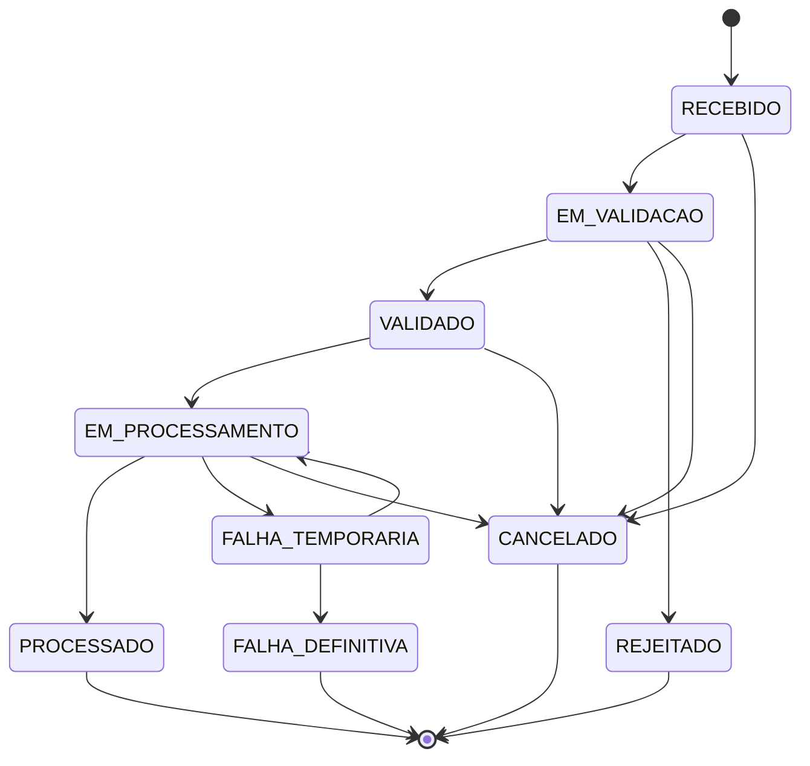
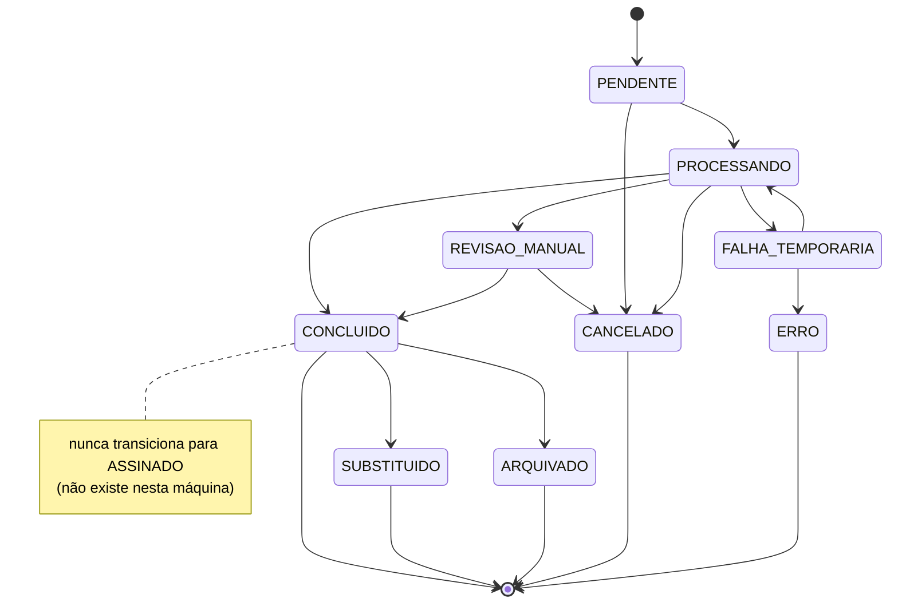
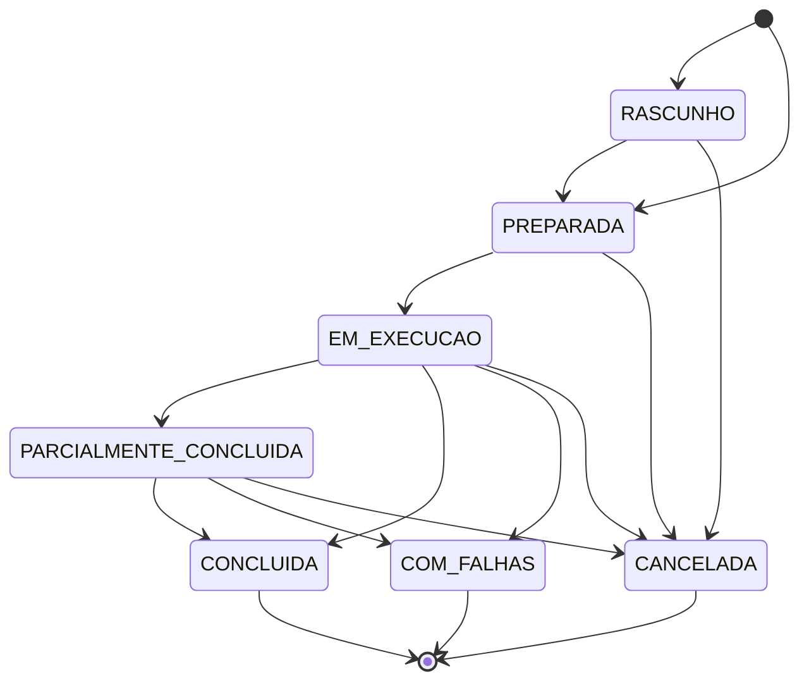
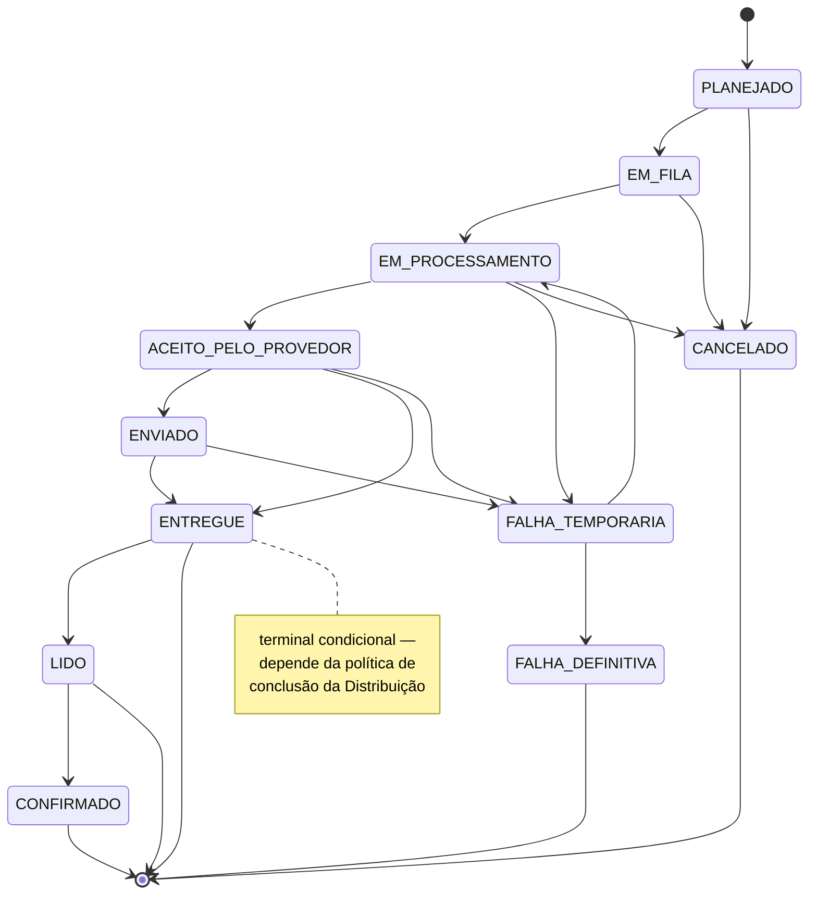
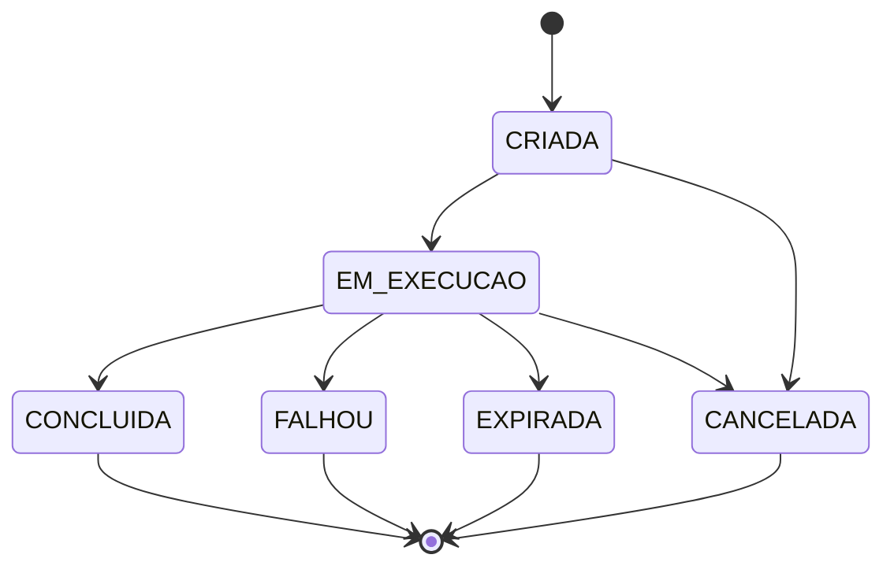
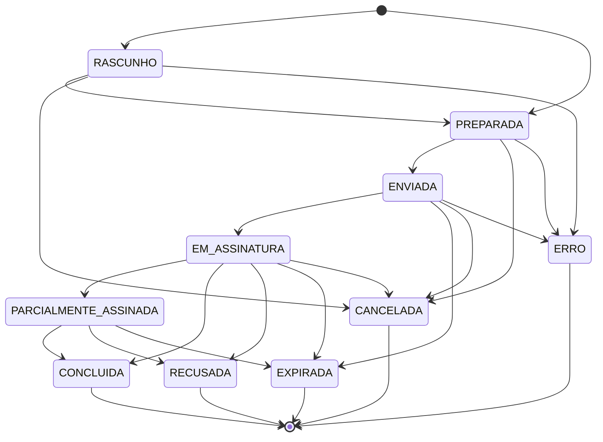
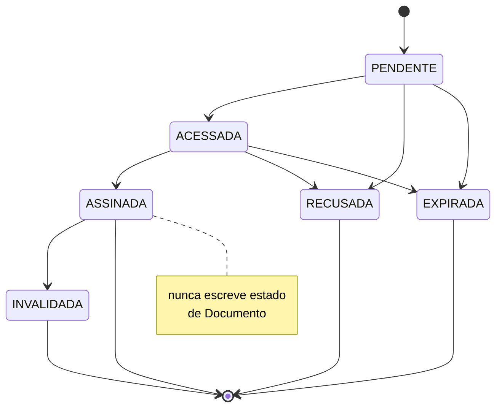
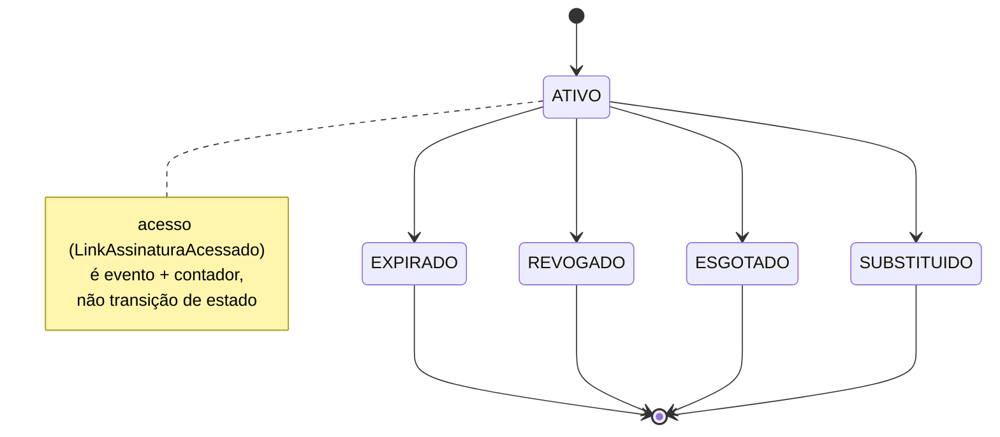

<!-- PROVENIÊNCIA (Etapa 3 da Central Command, 2026-08-22) — resgate documental.
Origem: branch `feat/magnata-os-claude-powerpack`, HEAD `053acada09dfc70bda71d2293aacbf2bca9ed43e`,
PR #12, FECHADO SEM MERGE em 2026-08-03T17:16:01Z. Texto original preservado;
as únicas alterações são a NOTA DE RECONCILIAÇÃO abaixo (quando existe) e a
de-identificação exigida por `CLAUDE.md` §6/LGPD, ambas declaradas.
Nenhuma decisão aprovada pela Direção foi alterada. -->

# Magnata OS — Máquinas de Estados Canônicas

**Versão:** 1.0
**Status:** CANÔNICO INICIAL — conceitual, não implementado
**Data:** 2026-07-22
**Fontes:** `MAGNATA_OS_MANIFESTO.md`, `MAGNATA_OS_ARQUITETURA.md`,
`MAGNATA_OS_ENTIDADES.md`, `MAGNATA_OS_DECISOES_ENTIDADES.md`,
`MAGNATA_OS_EVENTOS.md`, `MAGNATA_OS_CONTRATOS.md`.

**Natureza deste documento:** máquinas de estados **conceituais** — nomes de
estado, transições, evidências exigidas. Nenhuma classe, enum de código,
schema ou transição foi implementada. Nenhum estado foi renomeado no
Airtable.

**Reconciliação com `MAGNATA_OS_CONTRATOS.md`:** onde este documento
consolida ou rejeita um estado proposto pelo comando que o criou (avaliação
crítica pedida explicitamente em várias seções), a versão final aqui é a que
prevalece como vocabulário canônico — e, quando isso implica um vocabulário
mais enxuto do que o campo `estado_*` já registrado em
`MAGNATA_OS_CONTRATOS.md`, essa reconciliação é declarada explicitamente
seção a seção, não deixada como uma divergência silenciosa entre os dois
documentos.

Nenhum código, tabela do Airtable, configuração, memória ou outro documento
foi alterado para produzir este catálogo.

---

## 1. Princípios das Máquinas de Estados

- **Estado representa a situação atual** da entidade — não um fato, não uma
  intenção.
- **Evento representa um fato ocorrido** (`MAGNATA_OS_EVENTOS.md` §6) — é o
  que, tipicamente, prova que uma transição pode ocorrer.
- **Comando representa uma solicitação de ação** (`MAGNATA_OS_EVENTOS.md`
  §7) — pode ser negado; só produz transição se e quando o fato
  correspondente de fato acontece.
- **Um estado nunca é alterado sem fato ou decisão auditável.** Nenhuma
  transição "só porque sim" — toda linha de toda tabela de transições deste
  documento tem uma coluna de evidência ou condição.
- **Transições são explícitas.** Se uma transição não está na tabela da
  máquina correspondente, ela não é permitida — mesmo que pareça razoável.
- **Estado de uma entidade não é reaproveitado em outra entidade sem
  significado equivalente.** `CONCLUIDA` em Solicitação de Assinatura e
  `CONCLUIDA` em Distribuição são vocabulários homônimos por acaso de
  linguagem, nunca o mesmo campo ou a mesma máquina.
- **Resposta HTTP não é estado de negócio** (reforçado em toda máquina que
  envolve provedor externo — Envio, Tentativa de Envio).
- **Retry técnico não reinicia silenciosamente o ciclo de negócio** — ver
  §13.
- **Estados terminais não são reabertos sem transição específica** — quando
  o legítimo é "começar de novo", isso cria uma **nova entidade**
  (Reenvio → novo Envio; nova Solicitação deliberada → nova Solicitação),
  nunca reabre a antiga (§15).
- **Histórico de transições é preservado** — nenhuma máquina described aqui
  sobrescreve o registro de uma transição anterior; o estado atual é o
  último valor, mas o histórico de como se chegou até ali continua
  existindo (via os eventos que já o comprovam, `MAGNATA_OS_EVENTOS.md`
  §6).
- **Não se exige event sourcing completo nesta fase** — preservar histórico
  de transições via eventos já definidos é suficiente; reconstruir o
  estado inteiramente a partir do histórico é capacidade permitida, não
  arquitetura obrigatória (consistente com `MAGNATA_OS_EVENTOS.md` §6).
- **Uma falha nunca é convertida em sucesso por fallback silencioso** —
  nenhuma tabela de transição deste documento tem uma linha onde
  `FALHA_*` "vira" um estado de sucesso sem uma evidência nova e explícita
  que justifique isso.

---

## 2. Estrutura Obrigatória de Cada Máquina (template)

```text
### Nome da entidade

**Finalidade da máquina:** processo controlado.
**Estado inicial:** estado de criação.
**Estados intermediários:** estados possíveis durante o processo.
**Estados terminais:** conclusão, cancelamento ou falha definitiva.
**Estados recuperáveis:** falhas/situações que permitem nova tentativa.

**Tabela de transições:**
| Estado atual | Comando ou condição | Evento obrigatório | Novo estado | Evidência necessária | Transição automática? | Observações |

**Transições proibidas:** lista explícita.
**Reabertura ou retomada:** quando permitida.
**Idempotência:** comportamento em comandos repetidos.
**Correspondência no legado:** estados e campos atuais.
**Riscos de migração:** ambiguidades e efeitos.
```

Aplicado às 10 máquinas deste documento (5 obrigatórias, 3 opcionais de
assinatura, 1 obrigatória adicional de operação/controle, 1 candidata —
ver §20 para a separação exata).

---

## 3. Máquina de Item de Ingestão

**Avaliação crítica de `PROCESSADO`** (pedida explicitamente pelo comando):
das quatro leituras possíveis (arquivos extraídos, item consumido,
documentos gerados, processo integral concluído), a definição escolhida é
**"item consumido: todos os Arquivos foram extraídos e encaminhados para
Classificação"** — não significa que os Documentos resultantes já
concluíram classificação (isso pertence à máquina de Documento, §4). Item
de Ingestão é, por definição (`MAGNATA_OS_ENTIDADES.md` §5), o estágio
**anterior** à classificação — sua máquina termina onde a de Documento
começa, nunca se estende para dentro dela.

### Item de Ingestão

**Finalidade da máquina:** controlar a chegada e validação de um item de
origem até que seus Arquivos estejam extraídos e prontos para
classificação.
**Estado inicial:** `RECEBIDO`.
**Estados intermediários:** `EM_VALIDACAO`, `VALIDADO`, `EM_PROCESSAMENTO`.
**Estados terminais:** `PROCESSADO` (sucesso), `REJEITADO` (rejeição de
regra de negócio), `FALHA_DEFINITIVA` (falha técnica esgotada),
`CANCELADO` (decisão operacional).
**Estados recuperáveis:** `FALHA_TEMPORARIA`.

**Tabela de transições:**

| Estado atual | Comando ou condição | Evento obrigatório | Novo estado | Evidência necessária | Transição automática? | Observações |
|---|---|---|---|---|---|---|
| (nenhum) | `ReceberItemIngestao` | `ItemIngestaoRecebido` | `RECEBIDO` | persistência do registro | Não | estado inicial |
| `RECEBIDO` | início da checagem de remetente/formato | — | `EM_VALIDACAO` | — | Sim | transição automática, sem evento próprio se a checagem for trivial |
| `EM_VALIDACAO` | validação aprovada | `ItemIngestaoValidado` (candidato) | `VALIDADO` | remetente confiável, formato reconhecido | Sim | ver `MAGNATA_OS_EVENTOS.md` §A |
| `EM_VALIDACAO` | validação reprovada | `ItemIngestaoRejeitado` | `REJEITADO` | remetente não confiável ou formato inválido | Sim | terminal |
| `VALIDADO` | início da extração | — | `EM_PROCESSAMENTO` | — | Sim | — |
| `EM_PROCESSAMENTO` | todos os Arquivos extraídos | `ArquivoExtraido` (1 ou mais) | `PROCESSADO` | Arquivo(s) persistido(s) e vinculado(s) | Sim | terminal de sucesso — não implica Documento classificado |
| `EM_PROCESSAMENTO` | erro recuperável | `IngestaoFalhou` (`retryable=true`) | `FALHA_TEMPORARIA` | erro técnico contextualizado (§13) | Sim | — |
| `FALHA_TEMPORARIA` | retry automático dentro do limite | — | `EM_PROCESSAMENTO` | — | Sim | não é uma nova ingestão, é o mesmo Item retomado |
| `FALHA_TEMPORARIA` | limite de retry esgotado | `IngestaoFalhou` (`retryable=false`) | `FALHA_DEFINITIVA` | — | Sim | terminal |
| `RECEBIDO`/`EM_VALIDACAO`/`VALIDADO`/`EM_PROCESSAMENTO` | cancelamento operacional | — (comando explícito) | `CANCELADO` | decisão registrada, ator identificado | Não | terminal |

**Transições proibidas:**
- `RECEBIDO` → `PROCESSADO` diretamente (pular validação e processamento).
- `REJEITADO` → qualquer outro estado (é terminal; reentrega legítima do
  mesmo item cria um novo `ItemIngestao`, não reabre o rejeitado).
- `PROCESSADO` → `EM_PROCESSAMENTO` (reprocessar um item já consumido não
  é uma transição desta máquina — se um Documento precisar ser
  reprocessado, isso acontece na máquina de Documento, §4).
- `FALHA_DEFINITIVA` → qualquer estado de sucesso sem uma nova ingestão.

**Reabertura ou retomada:** só `FALHA_TEMPORARIA` → `EM_PROCESSAMENTO`
(retry automático dentro do limite). Nenhum estado terminal é reaberto.

**Idempotência:** comando `ReceberItemIngestao` repetido com o mesmo
`hash_sha256`/`origem_externa_id` não cria um novo Item de Ingestão nem
reinicia a máquina do zero — é reconhecido como o mesmo Item
(`MAGNATA_OS_CONTRATOS.md` §4).

**Correspondência no legado:** criação de registro em `Emails Savian` —
sem vocabulário de estado formal hoje (`F_EMAIL_STATUS` existe, mas seu
vocabulário exato não foi confirmado, `MAGNATA_OS_ENTIDADES.md` §5).

**Riscos de migração:** o legado não distingue `EM_VALIDACAO` de
`VALIDADO` nem tem estado técnico para falha temporária/definitiva — a
migração precisa inferir esses estados a partir de comportamento (ex.: um
registro que nunca gerou Arquivo pode estar em qualquer um dos estados
intermediários, sem forma de distinguir retroativamente).

---

## 4. Máquina de Documento

**Avaliação crítica obrigatória** (pedida explicitamente pelo comando): dos
13 estados propostos, vários são redundantes entre si. Consolidação
aplicada, com justificativa por estado rejeitado como redundante:

| Estado proposto | Decisão | Justificativa |
|---|---|---|
| `CRIADO` | mantido, renomeado `PENDENTE` | alinhado ao vocabulário já fixado em `MAGNATA_OS_CONTRATOS.md` §6 |
| `EM_CLASSIFICACAO` | mantido, renomeado `PROCESSANDO` | idem |
| `CLASSIFICADO` | **rejeitado, fundido em `CONCLUIDO`** | representa o mesmo fato de "classificação bem-sucedida" que `PROCESSADO`/`DISPONIVEL` — três nomes para um estado |
| `EM_PROCESSAMENTO` | **rejeitado, fundido em `PROCESSANDO`** | mesmo significado com nome diferente |
| `PROCESSADO` | **rejeitado, fundido em `CONCLUIDO`** | ver `CLASSIFICADO` acima |
| `EM_REVISAO` | mantido, renomeado `REVISAO_MANUAL` | alinhado a `MAGNATA_OS_CONTRATOS.md` §6 |
| `COM_PENDENCIA` | **rejeitado como estado de Documento** | é melhor representado pela **existência de uma Pendência Documental relacionada** (entidade própria, §11), não por um estado redundante no próprio Documento — um Documento em `REVISAO_MANUAL` com uma Pendência aberta já comunica isso via relacionamento |
| `DISPONIVEL` | **rejeitado, fundido em `CONCLUIDO`** | ver `CLASSIFICADO` acima |
| `SUBSTITUIDO` | **mantido como estado real** | necessário para quando um Documento é totalmente superado por um Documento Derivado (DEC-ENT-006/015) — não é sinônimo de nenhum outro |
| `ARQUIVADO` | **mantido como estado real** | distinto de `CONCLUIDO` — representa o fim do ciclo de retenção (política de retenção, `MAGNATA_OS_CONTRATOS.md` §12 do Tipo Documental, ainda pendente de detalhamento), não o fim do processamento |
| `CANCELADO` | mantido | — |
| `FALHA_TEMPORARIA` | mantido | — |
| `FALHA_DEFINITIVA` | **rejeitado, renomeado `ERRO`** | alinhado ao vocabulário já fixado em `MAGNATA_OS_CONTRATOS.md` §6 |

**Resultado: 9 estados**, não 13: `PENDENTE`, `PROCESSANDO`,
`FALHA_TEMPORARIA`, `REVISAO_MANUAL`, `CONCLUIDO`, `SUBSTITUIDO`,
`ARQUIVADO`, `CANCELADO`, `ERRO`.

**`ASSINADO` não existe nesta máquina, em nenhuma forma** — reforço direto
de DEC-ENT-022 e do achado crítico #1. Registrado expressamente:

- Documento distribuído **não** muda automaticamente para qualquer estado
  relacionado a assinatura — Distribuição e Documento têm máquinas
  separadas (§5).
- Documento assinado **continua** `CONCLUIDO` (ou o estado em que já
  estava) — o fato de ter sido assinado vive na máquina de Solicitação de
  Assinatura (§8) e no Arquivo Assinado relacionado (`arquivo_assinado_id`,
  `MAGNATA_OS_CONTRATOS.md` §13), nunca migra o estado do Documento.
- Falha de Envio **não transforma** automaticamente Documento em
  `FALHA_TEMPORARIA`/`ERRO` — são máquinas independentes (§6); um Documento
  pode estar `CONCLUIDO` com todos os seus Envios em falha.
- **Ausência de assinatura exigida não é pendência** — um Documento sem
  Solicitação de Assinatura associada permanece `CONCLUIDO` normalmente,
  nunca fica "esperando" uma assinatura que a regra de negócio nunca exigiu
  (DEC-ENT-022).

### Documento

**Finalidade da máquina:** controlar o ciclo de vida de classificação,
disponibilização e retenção de um Documento — **sem** incorporar o ciclo de
Distribuição, Envio ou Assinatura, que são máquinas próprias.
**Estado inicial:** `PENDENTE`.
**Estados intermediários:** `PROCESSANDO`, `REVISAO_MANUAL`.
**Estados terminais:** `CONCLUIDO` (com transições de saída limitadas —
ver abaixo, não é totalmente terminal), `SUBSTITUIDO`, `ARQUIVADO`,
`CANCELADO`, `ERRO`.
**Estados recuperáveis:** `FALHA_TEMPORARIA`.

**Tabela de transições:**

| Estado atual | Comando ou condição | Evento obrigatório | Novo estado | Evidência necessária | Transição automática? | Observações |
|---|---|---|---|---|---|---|
| (nenhum) | criação a partir de Arquivo classificado | `DocumentoCriado` | `PENDENTE` | Item de Ingestão + Arquivo de origem | Sim | — |
| `PENDENTE` | início do processamento | — | `PROCESSANDO` | — | Sim | — |
| `PROCESSANDO` | classificação com confiança suficiente | `ArquivoClassificado`, `DocumentoProcessamentoConcluido` | `CONCLUIDO` | Tipo Documental + Competência + titularidade definidos | Sim | — |
| `PROCESSANDO` | classificação com confiança insuficiente | `ArquivoClassificacaoInconclusiva` | `REVISAO_MANUAL` | confiança abaixo do piso, ou titularidade não identificada | Sim | dispara `PendenciaDocumentalCriada` (§11), relação, não estado embutido |
| `PROCESSANDO` | erro técnico recuperável | `DocumentoProcessamentoFalhou` (`retryable=true`) | `FALHA_TEMPORARIA` | erro contextualizado (§13) | Sim | — |
| `FALHA_TEMPORARIA` | retry dentro do limite | — | `PROCESSANDO` | — | Sim | — |
| `FALHA_TEMPORARIA` | limite esgotado | `DocumentoProcessamentoFalhou` (`retryable=false`) | `ERRO` | — | Sim | terminal |
| `REVISAO_MANUAL` | Pendência resolvida com classificação confirmada | `PendenciaDocumentalResolvida` | `CONCLUIDO` | decisão humana registrada | Não | — |
| `REVISAO_MANUAL` | Pendência resolvida como descarte | `PendenciaDocumentalResolvida` | `CANCELADO` | decisão humana registrada | Não | — |
| `CONCLUIDO` | Documento materialmente substituído | `DocumentoDerivadoCriado` | `SUBSTITUIDO` | novo Documento derivado criado, referenciando este | Não | o Documento original não desaparece, só para de ser o vigente |
| `CONCLUIDO` | política de retenção atingida | — (regra de retenção, ainda não detalhada) | `ARQUIVADO` | vigência da política aplicável | Sim (quando a política existir) | pendente de detalhamento em contrato futuro |
| qualquer estado não-terminal | cancelamento operacional | — (comando explícito) | `CANCELADO` | decisão registrada | Não | — |

**Transições proibidas:**
- Qualquer transição para um estado nomeado `ASSINADO` ou equivalente —
  **não existe** nesta máquina, nem como valor válido, nem como sinônimo.
- `SUBSTITUIDO`/`ARQUIVADO`/`CANCELADO`/`ERRO` → `PENDENTE`/`PROCESSANDO`
  (nenhum estado terminal reabre — um novo processamento exigiria um novo
  Documento, não a reabertura deste).
- Falha de Envio ou de Solicitação de Assinatura → qualquer transição
  neste Documento (máquinas independentes, ver acima).

**Reabertura ou retomada:** só `FALHA_TEMPORARIA` → `PROCESSANDO`. Nenhum
outro estado terminal é reaberto — `SUBSTITUIDO` é o caminho formal para
"este Documento não vale mais, use o derivado".

**Idempotência:** reclassificar o mesmo Arquivo (mesmo hash) não recria o
Documento nem reinicia a máquina — é reconhecido como o mesmo fato
(`MAGNATA_OS_CONTRATOS.md` §6).

**Correspondência no legado:** `Status` de `Processar Arquivos` —
`Pendente`, `Processando`, `Concluído`, `Revisão Manual`, `Erro`, **e
também `Assinado`** (achado crítico #1, `app.py:9896`) — este último
**não tem correspondência válida** nesta máquina (ver §18 para como tratar
ocorrências históricas).

**Riscos de migração:** todo registro histórico com `Status = 'Assinado'`
precisa ser reclassificado para `CONCLUIDO` **mais** uma Assinatura
associada reconstruída a partir do que existir em `Assinaturas` — perder
essa reconstrução apagaria o fato de que o documento foi assinado.

---

## 5. Máquina de Distribuição

**Consolidação aplicada:** `INICIADA` e `EM_EXECUCAO` são redundantes —
ambas descrevem "a Distribuição começou a gerar/processar Envios"; mantido
só `EM_EXECUCAO` (consistente com a nota já registrada em
`MAGNATA_OS_EVENTOS.md` §D sobre `DistribuicaoIniciada` ser candidato por
possível coincidência temporal com a criação). **Resultado: 7 estados**, não
8: `RASCUNHO`, `PREPARADA`, `EM_EXECUCAO`, `PARCIALMENTE_CONCLUIDA`,
`CONCLUIDA`, `COM_FALHAS`, `CANCELADA`.

### Distribuição

**Finalidade da máquina:** controlar a intenção de entrega até que a
política de conclusão seja satisfeita ou se torne inatingível.
**Estado inicial:** `RASCUNHO` (ou `PREPARADA`, quando a Distribuição já
nasce completa — `MAGNATA_OS_EVENTOS.md` §D).
**Estados intermediários:** `PREPARADA`, `EM_EXECUCAO`,
`PARCIALMENTE_CONCLUIDA`.
**Estados terminais:** `CONCLUIDA`, `COM_FALHAS`, `CANCELADA`.
**Estados recuperáveis:** `PARCIALMENTE_CONCLUIDA` (não é falha — é um
estado de espera legítimo enquanto a política não foi satisfeita nem
inviabilizada).

**Tabela de transições:**

| Estado atual | Comando ou condição | Evento obrigatório | Novo estado | Evidência necessária | Transição automática? | Observações |
|---|---|---|---|---|---|---|
| (nenhum) | `CriarDistribuicao` | `DistribuicaoCriada` | `RASCUNHO` ou `PREPARADA` | finalidade, Documentos, destinatários definidos (parcial ou completo) | Não | depende de construção incremental ou atômica |
| `RASCUNHO` | Documentos/destinatários/canais completos | `DocumentoAdicionadoADistribuicao`/`DestinatarioAdicionadoADistribuicao` (candidatos) | `PREPARADA` | todos os elementos obrigatórios presentes | Sim | só existe quando a construção é incremental |
| `PREPARADA` | início da geração de Envios | — | `EM_EXECUCAO` | 1º Envio criado | Sim | — |
| `EM_EXECUCAO` | 1 ou mais Envios concluíram, política ainda não satisfeita | — | `PARCIALMENTE_CONCLUIDA` | evidência de conclusão de cada Envio, sem atingir a política completa | Sim | **nunca** confundido com `CONCLUIDA` da Distribuição — DEC-ENT-013 |
| `EM_EXECUCAO`/`PARCIALMENTE_CONCLUIDA` | política de conclusão satisfeita | `DistribuicaoConcluida` | `CONCLUIDA` | todos os Envios relevantes atingiram o nível de evidência exigido pela política | Sim | terminal |
| `EM_EXECUCAO`/`PARCIALMENTE_CONCLUIDA` | política se torna inatingível | `DistribuicaoFalhou` | `COM_FALHAS` | todos os Envios relevantes falharam definitivamente, sem caminho restante para satisfazer a política | Sim | terminal |
| qualquer estado não-terminal | cancelamento operacional | `DistribuicaoCancelada` | `CANCELADA` | decisão registrada | Não | terminal |

**Transições proibidas:**
- `EM_EXECUCAO` → `CONCLUIDA` só porque **1** Envio concluiu, quando a
  política exige mais (DEC-ENT-013 — reforço central desta máquina).
- `COM_FALHAS`/`CONCLUIDA`/`CANCELADA` → qualquer estado não-terminal
  (terminais reais; uma nova tentativa de distribuição é uma **nova**
  Distribuição).
- Adicionar Documento/destinatário a uma Distribuição já `EM_EXECUCAO` sem
  regra explícita que permita construção incremental tardia.

**Reabertura ou retomada:** nenhuma — os três estados terminais não
reabrem; uma nova necessidade de distribuir gera nova Distribuição.

**Idempotência:** criar a mesma Distribuição (mesmo Documento, finalidade,
destinatários) por retry técnico não duplica o registro nem reinicia a
máquina de uma já existente.

**Correspondência no legado:** inexistente como máquina separada — hoje
embutida na criação direta de `Envios de Documentos`.

**Riscos de migração:** os 4 fluxos de fila+disparo por canal não têm
noção de "Distribuição concluída" separada de "Envio concluído" — migrar
exige introduzir essa camada antes de qualquer consumidor depender da
política de conclusão agregada.

---

## 6. Máquina de Envio

Vocabulário **fixado por DEC-ENT-020** — usado exatamente como aprovado,
sem consolidação adicional (os 11 estados já foram avaliados naquela
decisão):

`PLANEJADO`, `EM_FILA`, `EM_PROCESSAMENTO`, `ACEITO_PELO_PROVEDOR`,
`ENVIADO`, `ENTREGUE`, `LIDO`, `CONFIRMADO`, `FALHA_TEMPORARIA`,
`FALHA_DEFINITIVA`, `CANCELADO`.

### Envio

**Finalidade da máquina:** controlar cada entrega concreta, do
planejamento até o nível de evidência mais alto que o canal sustentar.
**Estado inicial:** `PLANEJADO`.
**Estados intermediários:** `EM_FILA`, `EM_PROCESSAMENTO`,
`ACEITO_PELO_PROVEDOR`, `ENVIADO`, `ENTREGUE`, `LIDO`.
**Estados terminais:** `CONFIRMADO`, `FALHA_DEFINITIVA`, `CANCELADO` — e,
**condicionalmente**, `ENTREGUE`/`LIDO` são terminais **quando** a política
de conclusão da Distribuição de origem não exige nível mais alto (ver nota
abaixo).
**Estados recuperáveis:** `FALHA_TEMPORARIA`.

**Nota sobre terminalidade condicional:** este é o único caso, entre as 10
máquinas deste documento, em que um estado é terminal **para uma
Distribuição** mas não estruturalmente terminal **para o Envio em si** —
`ENTREGUE` pode, em tese, ainda evoluir para `LIDO` se o sinal chegar depois
(§13, ordenação e causalidade). O que determina se o processo "parou ali"
é a política de conclusão da Distribuição (§5), não uma regra fixa desta
máquina.

**Tabela de transições:**

| Estado atual | Comando ou condição | Evento obrigatório | Novo estado | Evidência necessária | Transição automática? | Observações |
|---|---|---|---|---|---|---|
| (nenhum) | `CriarEnvio` | `EnvioCriado` | `PLANEJADO` | Destinatário + Canal + Documento definidos | Não | — |
| `PLANEJADO` | `ColocarEnvioNaFila` | `EnvioColocadoNaFila` | `EM_FILA` | — | Sim (quando há fila real) | pode ser pulado se o processamento for síncrono |
| `EM_FILA` | `ProcessarEnvio` | — | `EM_PROCESSAMENTO` | saída da fila | Sim | — |
| `EM_PROCESSAMENTO` | chamada ao provedor aceita | `EnvioAceitoPeloProvedor` | `ACEITO_PELO_PROVEDOR` | conteúdo semântico da resposta confirma aceitação — **nunca** só HTTP 200/201 | Sim | ver §13 |
| `ACEITO_PELO_PROVEDOR` | despacho confirmado | `EnvioDespachadoPeloProvedor` | `ENVIADO` | sinal de despacho do provedor, distinto de aceitação | Sim | pode ser pulado (§6, "quais estados são opcionais por canal", abaixo) |
| `ENVIADO` (ou `ACEITO_PELO_PROVEDOR`, se `ENVIADO` for pulado) | confirmação de entrega | `EnvioEntregue` | `ENTREGUE` | sinal técnico real de entrega | Sim | terminal condicional (ver nota) |
| `ENTREGUE` | confirmação de leitura | `EnvioLido` | `LIDO` | sinal de leitura (ex.: link de recibo acessado) | Sim | pode chegar depois de `FALHA_TEMPORARIA` ter sido registrada por timeout (§13) |
| `LIDO` | ação inequívoca do destinatário | `EnvioConfirmadoPeloDestinatario` | `CONFIRMADO` | resposta/confirmação/download autenticado | Sim | terminal |
| `EM_PROCESSAMENTO`/`ACEITO_PELO_PROVEDOR`/`ENVIADO` | falha recuperável | `EnvioFalhaTemporariaRegistrada` | `FALHA_TEMPORARIA` | erro técnico contextualizado, com Tentativas restantes | Sim | — |
| `FALHA_TEMPORARIA` | retry dentro do limite | — (nova Tentativa de Envio, §7) | `EM_PROCESSAMENTO` | — | Sim | não é um novo Envio |
| `FALHA_TEMPORARIA` | limite esgotado ou erro não-recuperável | `EnvioFalhaDefinitivaRegistrada` | `FALHA_DEFINITIVA` | — | Sim | terminal |
| `PLANEJADO`/`EM_FILA`/`EM_PROCESSAMENTO` | cancelamento operacional | `EnvioCancelado` | `CANCELADO` | decisão registrada | Não | terminal |

**Quais estados são opcionais por canal:** `ENVIADO` (despacho distinto de
aceitação) pode não existir para canais que não fazem essa distinção —
nesse caso, `ACEITO_PELO_PROVEDOR` → `ENTREGUE` diretamente. `LIDO` e
`CONFIRMADO` são opcionais para canais que não suportam esses níveis de
evidência (ex.: e-mail sem pixel de rastreamento) — **nunca inventados**
quando o canal não sustenta o sinal (DEC-ENT-009).

**Transições que podem pular estados:** quando o provedor entrega
evidência mais avançada de uma vez (ex.: um webhook único que já confirma
entrega, sem eventos intermediários de aceite/despacho), a máquina avança
diretamente para o estado correspondente ao nível mais alto informado —
não é obrigatório passar por todos os estados intermediários
artificialmente.

**Confirmação atrasada após timeout:** se `FALHA_TEMPORARIA` foi registrada
por timeout e, depois, uma confirmação de entrega real chega, o Envio
avança para `ENTREGUE` (ou o nível informado) a partir do estado em que
estava — **o registro de `FALHA_TEMPORARIA` original permanece no
histórico**, não é apagado (§13).

**Conflito entre falha aparente e entrega posterior:** tratado como
**duas evidências preservadas**, não como escolha de uma sobre a outra — o
estado final reflete a evidência mais recente e mais forte
(`CONFIRMADO` > `LIDO` > `ENTREGUE` > `ACEITO_PELO_PROVEDOR`), mas o
histórico de ambas fica auditável.

**Quando falha temporária se torna definitiva:** quando o limite de
Tentativas (§7) é esgotado, ou quando o provedor retorna um erro
explicitamente não-recuperável (ex.: número de telefone inválido) — nesse
segundo caso, a transição para `FALHA_DEFINITIVA` pode ocorrer mesmo antes
de esgotar o limite numérico de tentativas.

**Quando cancelamento ainda é possível:** só antes de `ACEITO_PELO_PROVEDOR`
— depois que o provedor aceitou a mensagem, o Magnata OS não tem mais
controle sobre impedir a entrega; "cancelar" nesse ponto seria uma
tentativa de negócio (ex.: mensagem de retratação), não uma transição desta
máquina.

**Transições proibidas:**
- Qualquer transição para `ENTREGUE`/`LIDO`/`CONFIRMADO` sem a evidência
  correspondente — **nunca inventada** por inferência (DEC-ENT-009).
- HTTP 200/201 de transporte, isoladamente, **nunca** produz nada além de,
  no máximo, `ACEITO_PELO_PROVEDOR` — e só quando o corpo da resposta
  também confirma aceitação real, não apenas ausência de erro de rede.
- `FALHA_DEFINITIVA`/`CANCELADO`/`CONFIRMADO` → qualquer outro estado
  (terminais reais).

**Reabertura ou retomada:** `FALHA_TEMPORARIA` → `EM_PROCESSAMENTO` via
nova Tentativa (§7). Nenhum estado terminal reabre — Reenvio cria um novo
Envio (DEC-ENT-007).

**Idempotência:** ver Contrato de Envio (`MAGNATA_OS_CONTRATOS.md` §10) —
criação repetida por retry técnico não duplica o Envio.

**Correspondência no legado:** `Status` de `Envios de Documentos` —
`Preparando`/`Enviado`/`Concluído`/`Lido` (comentário) e `'Erro'` (uso
real no código) — vocabulário bem mais pobre que os 11 estados canônicos.

**Riscos de migração:** o legado não distingue `ACEITO_PELO_PROVEDOR` de
`ENTREGUE` — ambos provavelmente colapsam em `'Enviado'` hoje; a migração
não pode assumir que todo `'Enviado'` histórico significa entrega real
confirmada — na dúvida, mapear para o nível de evidência mais baixo
defensável.

---

## 7. Máquina de Tentativa de Envio

**Avaliação crítica de `ACEITA` × `CONCLUIDA`** (pedida explicitamente): as
duas são redundantes no nível da Tentativa — "o provedor aceitou esta
tentativa específica" e "a tentativa terminou com sucesso" descrevem o
mesmo instante técnico quando o resultado é positivo; a nuance de
"aceito mas ainda não confirmado" pertence ao **Envio**
(`ACEITO_PELO_PROVEDOR` → `ENVIADO` → `ENTREGUE`, §6), não à Tentativa, cujo
papel é só registrar se a execução técnica teve sucesso ou falhou.
**Resultado: 6 estados**, não 7: `CRIADA`, `EM_EXECUCAO`, `CONCLUIDA`,
`FALHOU`, `EXPIRADA`, `CANCELADA` (`ACEITA` fundida em `CONCLUIDA`).

### Tentativa de Envio

**Finalidade da máquina:** controlar cada execução técnica isolada dentro
de um Envio — **não** duplica o vocabulário do Envio.
**Estado inicial:** `CRIADA`.
**Estados intermediários:** `EM_EXECUCAO`.
**Estados terminais:** `CONCLUIDA`, `FALHOU`, `EXPIRADA`, `CANCELADA`.
**Estados recuperáveis:** nenhum — uma Tentativa que falha não "se
recupera"; uma **nova** Tentativa é criada (ela é, em si, o mecanismo de
recuperação do Envio, não algo que se recupera internamente).

**Tabela de transições:**

| Estado atual | Comando ou condição | Evento obrigatório | Novo estado | Evidência necessária | Transição automática? | Observações |
|---|---|---|---|---|---|---|
| (nenhum) | início de execução técnica | — | `CRIADA` | Envio de origem existente | Sim | — |
| `CRIADA` | chamada ao provedor iniciada | — | `EM_EXECUCAO` | — | Sim | — |
| `EM_EXECUCAO` | resposta de sucesso do provedor | — | `CONCLUIDA` | resposta semântica de aceitação (não só HTTP 200/201) | Sim | pode alterar o Envio para `ACEITO_PELO_PROVEDOR` (§6) |
| `EM_EXECUCAO` | erro técnico | `TentativaEnvioFalhou` | `FALHOU` | erro contextualizado (§13) | Sim | não implica automaticamente falha definitiva do Envio |
| `EM_EXECUCAO` | tempo limite excedido sem resposta | `TentativaEnvioFalhou` (categoria timeout) | `EXPIRADA` | ausência de resposta dentro do prazo | Sim | distinto de `FALHOU` — resultado desconhecido, não erro confirmado |
| `CRIADA`/`EM_EXECUCAO` | cancelamento operacional | — | `CANCELADA` | decisão registrada | Não | raro — tipicamente só se o Envio inteiro for cancelado antes da execução concluir |

**Transições proibidas:**
- `FALHOU`/`EXPIRADA`/`CANCELADA`/`CONCLUIDA` → qualquer outro estado
  (terminais reais — uma nova execução é uma **nova** Tentativa, com seu
  próprio `tentativa_envio_id`).
- Uma Tentativa `FALHOU` **nunca**, por si só, transiciona o Envio para
  `FALHA_DEFINITIVA` — essa decisão pertence à máquina de Envio (§6),
  considerando o número de Tentativas já esgotadas.

**Reabertura ou retomada:** nenhuma — cada retry é uma Tentativa nova,
nunca a reabertura de uma anterior.

**Idempotência:** não aplicável como duplicidade a evitar — cada Tentativa
é, por definição, um fato técnico novo, mesmo quando o resultado se repete
(`MAGNATA_OS_EVENTOS.md` §9).

**Correspondência no legado:** contador `Tentativa` (campo numérico) —
sem registro individual, sem os 6 estados distintos.

**Riscos de migração:** sem histórico por tentativa, a distinção
`FALHOU` × `EXPIRADA` não é reconstruível para dados históricos — a
migração só ganha essa granularidade a partir do momento em que o novo
contrato entrar em vigor.

---

## 8. Máquina de Solicitação de Assinatura

Vocabulário **fixado por DEC-ENT-027** — usado exatamente como aprovado:
`RASCUNHO`, `PREPARADA`, `ENVIADA`, `EM_ASSINATURA`,
`PARCIALMENTE_ASSINADA`, `CONCLUIDA`, `RECUSADA`, `EXPIRADA`, `CANCELADA`,
`ERRO` (10 estados).

### Solicitação de Assinatura

**Finalidade da máquina:** controlar o processo de obter uma ou mais
assinaturas sobre um Documento/Arquivo, conforme a política de conclusão.
**Estado inicial:** `RASCUNHO` (ou `PREPARADA`, se já nascer completa).
**Estados intermediários:** `PREPARADA`, `ENVIADA`, `EM_ASSINATURA`,
`PARCIALMENTE_ASSINADA`.
**Estados terminais:** `CONCLUIDA`, `RECUSADA`, `EXPIRADA`, `CANCELADA`,
`ERRO`.
**Estados recuperáveis:** nenhum formalmente — `ERRO` aqui é técnico
(falha de geração/infraestrutura), não uma falha de negócio recuperável
por retry automático; uma correção manual seguida de nova Solicitação
deliberada é o caminho, não a reabertura desta.

**Tabela de transições:**

| Estado atual | Comando ou condição | Evento obrigatório | Novo estado | Evidência necessária | Transição automática? | Observações |
|---|---|---|---|---|---|---|
| (nenhum) | `CriarSolicitacaoAssinatura` | `SolicitacaoAssinaturaCriada` | `RASCUNHO`/`PREPARADA` | Documento + Arquivo + política de conclusão + Signatários definidos (parcial ou completo) | Não | gatilho de exigência confirmado (DEC-ENT-022) antes de existir |
| `RASCUNHO` | Signatários e política completos | — | `PREPARADA` | todos os elementos definidos | Sim | — |
| `PREPARADA` | `GerarLinkAssinatura` para ao menos 1 Signatário | `SolicitacaoAssinaturaEnviada` | `ENVIADA` | Link(s) disponibilizado(s) — **não significa assinatura** | Não | Envio de Link ≠ Assinatura (reforço central) |
| `ENVIADA` | 1º acesso de qualquer Signatário | `LinkAssinaturaAcessado` | `EM_ASSINATURA` | acesso registrado — **não conclui, apenas inicia** | Sim | — |
| `EM_ASSINATURA` | 1ª Assinatura válida, política ainda não satisfeita | `AssinaturaRealizada` | `PARCIALMENTE_ASSINADA` | política ainda pendente de mais Assinaturas | Sim | ver regra de política abaixo |
| `EM_ASSINATURA`/`PARCIALMENTE_ASSINADA` | política satisfeita | `SolicitacaoAssinaturaConcluida` | `CONCLUIDA` | condição da política (`TODOS`/`QUALQUER_UM`/`QUANTIDADE_MINIMA`/`SEQUENCIAL`) atingida | Sim | terminal |
| `EM_ASSINATURA`/`PARCIALMENTE_ASSINADA` | recusa que inviabiliza a política | `SolicitacaoAssinaturaRecusada` | `RECUSADA` | recusa de Signatário obrigatório | Sim | terminal |
| `ENVIADA`/`EM_ASSINATURA`/`PARCIALMENTE_ASSINADA` | prazo esgotado sem satisfazer a política | `SolicitacaoAssinaturaExpirada` | `EXPIRADA` | `expira_em` atingido | Sim | terminal |
| qualquer estado não-terminal | cancelamento operacional | `SolicitacaoAssinaturaCancelada` | `CANCELADA` | decisão registrada | Não | terminal |
| qualquer estado | falha técnica de geração/infraestrutura | `SolicitacaoAssinaturaFalhou` | `ERRO` | erro contextualizado (§13) | Sim | terminal |

**Como a recusa afeta cada política:**
- `TODOS`: qualquer recusa individual inviabiliza — transição imediata
  para `RECUSADA`.
- `QUALQUER_UM`: recusa de 1 Signatário não inviabiliza enquanto outros
  Signatários ainda puderem assinar — só vai para `RECUSADA` se **todos**
  recusarem ou expirarem.
- `QUANTIDADE_MINIMA`: recusa só inviabiliza quando o número de Signatários
  restantes capazes de assinar cai abaixo do mínimo exigido.
- `SEQUENCIAL`: recusa de um Signatário na sequência inviabiliza a
  continuidade — os Signatários seguintes na ordem não podem assinar sem
  o anterior.

**Quando uma nova Solicitação substitui ou se relaciona à anterior:** uma
nova Solicitação deliberada (`solicitacao_anterior_id` preenchido,
`MAGNATA_OS_CONTRATOS.md` §13) é criada quando o Documento/Arquivo muda
materialmente (ex.: versão corrigida) — a anterior permanece no estado em
que estava (tipicamente `RECUSADA`/`EXPIRADA`/`CANCELADA`), **nunca é
reaberta ou sobrescrita** pela nova.

**Transições proibidas:**
- `CONCLUIDA` por causa de **uma** Assinatura isolada, quando a política
  exige mais — mesma lógica de DEC-ENT-013 aplicada aqui.
- `RASCUNHO`/`PREPARADA` → `EM_ASSINATURA` sem passar por `ENVIADA` (não
  há como um Signatário acessar um Link que nunca foi enviado).
- Qualquer estado terminal → estado não-terminal (retry técnico da criação
  não reabre — DEC-ENT-029).

**Reabertura ou retomada:** nenhuma — todos os 5 estados terminais são
reais; uma nova necessidade gera nova Solicitação, com referência à
anterior quando aplicável.

**Idempotência:** criação repetida por retry técnico não gera uma segunda
Solicitação (DEC-ENT-029) — a chave de idempotência da operação é distinta
do `solicitacao_assinatura_id`.

**Correspondência no legado:** `Status` de `Assinaturas` —
`Pendente`/`Assinado`/`Expirado`, vocabulário pensado para 1 Signatário só.

**Riscos de migração:** o legado não distingue `PARCIALMENTE_ASSINADA` de
`EM_ASSINATURA` nem tem noção de política de múltiplos Signatários — toda
Solicitação legada migra assumindo política `TODOS` com 1 único Signatário
(o Colaborador vinculado), até que um caso real de múltiplos signatários
force o refinamento.

---

## 9. Máquina de Assinatura Individual

Vocabulário **fixado por DEC-ENT-028** — usado exatamente como aprovado:
`PENDENTE`, `ACESSADA`, `ASSINADA`, `RECUSADA`, `EXPIRADA`, `INVALIDADA`
(6 estados).

### Assinatura Individual (por Signatário)

**Finalidade da máquina:** controlar o ciclo de vida de um Signatário
específico dentro de uma Solicitação — **não controla, em nenhuma
hipótese, o estado do Documento** (reforço direto do achado crítico #1).
**Estado inicial:** `PENDENTE`.
**Estados intermediários:** `ACESSADA`.
**Estados terminais:** `ASSINADA`, `RECUSADA`, `EXPIRADA`, `INVALIDADA`.
**Estados recuperáveis:** nenhum — os terminais são reais; uma nova
Solicitação (ou, se aplicável, um novo Link para o mesmo Signatário dentro
da mesma Solicitação, antes de expirar) é o caminho de correção.

**Tabela de transições:**

| Estado atual | Comando ou condição | Evento obrigatório | Novo estado | Evidência necessária | Transição automática? | Observações |
|---|---|---|---|---|---|---|
| (nenhum) | `SignatarioAdicionado` | — | `PENDENTE` | Signatário definido na Solicitação | Não | — |
| `PENDENTE` | 1º acesso ao Link | `LinkAssinaturaAcessado` | `ACESSADA` | acesso registrado | Sim | **não** significa assinatura |
| `ACESSADA` | `RegistrarAssinatura` | `AssinaturaRealizada` | `ASSINADA` | evidência mínima capturada e validada (DEC-ENT-025) — **nunca** só a aparência de tela de sucesso | Não | terminal |
| `PENDENTE`/`ACESSADA` | recusa explícita | `AssinaturaRecusada` | `RECUSADA` | ato e momento da recusa preservados | Não | terminal |
| `PENDENTE`/`ACESSADA` | prazo esgotado sem assinar | `AssinaturaExpirada` | `EXPIRADA` | validade do Link/Solicitação atingida | Sim | terminal |
| `ASSINADA` | invalidação (ex.: fraude identificada) | `AssinaturaInvalidada` | `INVALIDADA` | motivo registrado, decisão auditável | Não | terminal — **não apaga o histórico anterior** |

**Transições proibidas:**
- Qualquer transição que grave o valor resultante em um campo de estado do
  Documento — esta máquina só afeta o Signatário/Assinatura, nunca o
  Documento (reforço absoluto).
- `ASSINADA` → `PENDENTE`/`ACESSADA` (uma assinatura realizada não "volta"
  a pendente — se inválida, vira `INVALIDADA`, preservando o histórico).
- `RECUSADA`/`EXPIRADA`/`INVALIDADA` → `ASSINADA` sem uma nova Assinatura
  (nova Solicitação ou novo ciclo, nunca a reabertura desta).

**Reabertura ou retomada:** nenhuma. `INVALIDADA` não retorna a `ASSINADA`
— uma nova Assinatura (em uma nova Solicitação, tipicamente) é necessária.

**Idempotência:** submissão dupla do mesmo formulário de assinatura não
gera duas Assinaturas para o mesmo Signatário.

**Correspondência no legado:** mesmo `Status` de `Assinaturas`
(`Pendente`/`Assinado`/`Expirado`) usado tanto para a Solicitação quanto
para a Assinatura individual — os dois nunca foram distinguidos no legado.

**Riscos de migração:** a migração precisa decidir, para cada registro
histórico, se o `Status` observado representa o estado da Solicitação
(§8) ou da Assinatura individual (esta máquina) — no legado (1 Signatário
por Solicitação), os dois coincidem na prática, o que simplifica a
migração de dados existentes mas não deve ser generalizado como regra para
o modelo novo.

---

## 10. Máquina de Link de Assinatura

**Avaliação crítica de `ACESSADO`** (pedida explicitamente): não deve ser
um **estado exclusivo** — um Link pode ser acessado várias vezes e
continuar `ATIVO` (dentro do `limite_acessos`); tratar acesso como estado
faria o Link "sair" de `ATIVO` no primeiro clique, o que está errado. A
solução: acesso é **evento + contador** (`LinkAssinaturaAcessado` +
`quantidade_acessos`, `MAGNATA_OS_CONTRATOS.md` §13), não um estado da
máquina. **Um Link não pode voltar a `ATIVO`** depois de qualquer estado
terminal — gerar um novo Link é sempre a resposta, nunca reativar o
antigo (DEC-ENT-024). **Resultado: 5 estados**, não 6: `ATIVO`,
`EXPIRADO`, `REVOGADO`, `ESGOTADO`, `SUBSTITUIDO` (`ACESSADO` rejeitado
como estado).

### Link de Assinatura

**Finalidade da máquina:** controlar a validade de uma credencial temporária
de acesso a uma Solicitação de Assinatura.
**Estado inicial:** `ATIVO`.
**Estados intermediários:** nenhum — um Link só tem estado inicial e
estados terminais; acesso é evento, não estado (ver acima).
**Estados terminais:** `EXPIRADO`, `REVOGADO`, `ESGOTADO`, `SUBSTITUIDO`.
**Estados recuperáveis:** nenhum.

**Tabela de transições:**

| Estado atual | Comando ou condição | Evento obrigatório | Novo estado | Evidência necessária | Transição automática? | Observações |
|---|---|---|---|---|---|---|
| (nenhum) | `GerarLinkAssinatura` | `LinkAssinaturaCriado` | `ATIVO` | Solicitação/Signatário relacionados | Não | — |
| `ATIVO` | acesso dentro do limite | `LinkAssinaturaAcessado` | `ATIVO` (permanece) | — | Sim | **não é transição de estado** — só incrementa `quantidade_acessos` |
| `ATIVO` | validade atingida | `LinkAssinaturaExpirado` | `EXPIRADO` | `expira_em` atingido | Sim | terminal |
| `ATIVO` | revogação explícita | `LinkAssinaturaRevogado` | `REVOGADO` | motivo registrado | Não | terminal |
| `ATIVO` | `quantidade_acessos` atinge `limite_acessos` | — | `ESGOTADO` | limite configurado atingido | Sim | terminal |
| `ATIVO` | novo Link gerado para a mesma Solicitação/Signatário | — | `SUBSTITUIDO` | novo `LinkAssinatura` criado | Sim | o Link antigo não é apagado, só marcado substituído |

**Transições proibidas:**
- Qualquer estado terminal → `ATIVO` (nenhum Link é reativado — gera-se
  um novo).
- Uso de um Link `EXPIRADO`/`REVOGADO`/`ESGOTADO`/`SUBSTITUIDO` para
  produzir `LinkAssinaturaAcessado` válido — o acesso é registrado como
  tentativa negada, não como evento de sucesso.

**Reabertura ou retomada:** nenhuma. Gerar um novo Link é sempre a
resposta correta — o histórico do anterior permanece (DEC-ENT-024).

**Idempotência:** gerar Link duas vezes pela mesma solicitação técnica
(retry) não deve criar dois Links representando a mesma credencial — a
idempotência é da operação de geração, não do Link em si (cada geração
real e deliberada é, de fato, um Link novo).

**Correspondência no legado:** campo `Hash Token` — um único valor por
registro de `Assinaturas`, sem os 5 estados nem histórico de gerações.

**Riscos de migração:** todo `Hash Token` legado migra como um Link
`ATIVO` (ou `EXPIRADO`, conforme o `Status` da Assinatura associada) — sem
histórico de Links anteriores, se algum dia existiram.

---

## 11. Máquina de Pendência Documental

### Pendência Documental

**Finalidade da máquina:** controlar a revisão humana de um Documento que
não pôde ser processado automaticamente com confiança suficiente.
**Estado inicial:** `ABERTA`.
**Estados intermediários:** `EM_ANALISE`, `AGUARDANDO_INFORMACAO`.
**Estados terminais:** `RESOLVIDA`, `DESCARTADA`, `CANCELADA`.
**Estados recuperáveis:** `AGUARDANDO_INFORMACAO` (não é falha — é espera
legítima por dado adicional).

**Tabela de transições:**

| Estado atual | Comando ou condição | Evento obrigatório | Novo estado | Evidência necessária | Transição automática? | Observações |
|---|---|---|---|---|---|---|
| (nenhum) | Documento cai em confiança insuficiente | `PendenciaDocumentalCriada` | `ABERTA` | motivo e Documento relacionado (obrigatórios) | Sim | disparada pela máquina de Documento (§4), não o inverso |
| `ABERTA` | início de revisão humana | — | `EM_ANALISE` | ator responsável identificado | Não | — |
| `EM_ANALISE` | falta dado externo para decidir | — | `AGUARDANDO_INFORMACAO` | motivo da espera registrado | Não | — |
| `AGUARDANDO_INFORMACAO` | dado obtido | — | `EM_ANALISE` | informação recebida | Não | — |
| `EM_ANALISE` | decisão de classificação confirmada | `PendenciaDocumentalResolvida` | `RESOLVIDA` | decisão e evidência registradas | Não | Documento associado avança para `CONCLUIDO` (§4) |
| `EM_ANALISE` | decisão de descarte (documento inválido/irrelevante) | `PendenciaDocumentalResolvida` | `DESCARTADA` | decisão e evidência registradas | Não | Documento associado avança para `CANCELADO` (§4) |
| qualquer estado não-terminal | cancelamento operacional | — | `CANCELADA` | decisão registrada | Não | terminal — distinto de `DESCARTADA` (esta é encerramento administrativo, não decisão sobre o conteúdo) |

**Registrado expressamente:**
- **Pendência não é falha técnica** — vive numa máquina própria, distinta
  de `FALHA_TEMPORARIA`/`ERRO` do Documento (§4).
- Toda Pendência tem motivo e entidade relacionada obrigatórios — nunca
  criada "vazia".
- Resolução sempre registra decisão e evidência — nunca um simples
  `RESOLVIDA` sem rastro de por quê.
- **Não reutilizar esta máquina para Alerta de Ponto enquanto DEC-ENT-010
  estiver `PENDENTE`** — esta máquina e a de §12 são independentes até
  decisão em contrário.

**Transições proibidas:** `RESOLVIDA`/`DESCARTADA`/`CANCELADA` → qualquer
estado não-terminal (terminais reais).

**Reabertura ou retomada:** nenhuma formal — se o mesmo Documento gerar
nova dúvida depois de resolvido, isso é avaliado como possível nova
Pendência, não reabertura da anterior (a decidir com mais detalhe fora
deste documento).

**Idempotência:** duas tentativas técnicas de criar Pendência para o mesmo
Documento pela mesma causa não geram duas Pendências abertas simultâneas.

**Correspondência no legado:** `Status` de `Pendências/Revisar` — hoje só
`Pendente` confirmado; vocabulário além disso não confirmado
(`MAGNATA_OS_ENTIDADES.md` §5).

**Riscos de migração:** a tabela `Pendências/Revisar` é **compartilhada**
com Alerta de Ponto (achado crítico #2) — migrar esta máquina exige
primeiro separar os registros por domínio, ou o adaptador corre risco de
tratar um Alerta de Ponto como se fosse uma Pendência Documental.

---

## 12. Máquina Candidata de Alerta de Ponto

**Esta máquina é candidata, não canônica**, enquanto `DEC-ENT-010`
(relação com Pendência Documental) e `DEC-ENT-011` (significado de
`Fechamento`/`SBJ`) seguirem `PENDENTE`. Nada abaixo assume:
- que Alerta de Ponto é (ou não é) Pendência Documental;
- o significado final de `Fechamento` ou `SBJ`.

### Alerta de Ponto (candidata)

**Finalidade da máquina (candidata):** controlar o ciclo de tratamento de
um desvio de ponto identificado via Secullum.
**Estado inicial (candidato):** `IDENTIFICADO`.
**Estados intermediários (candidatos):** `EM_ANALISE`,
`JUSTIFICACAO_SOLICITADA`, `JUSTIFICADO`.
**Estados terminais (candidatos):** `CORRIGIDO`, `DESCARTADO`, `RESOLVIDO`.
**Estados recuperáveis:** não aplicável nesta proposta.

**Tabela de transições (candidata, não vinculante):**

| Estado atual | Comando ou condição | Evento obrigatório | Novo estado | Evidência necessária | Transição automática? | Observações |
|---|---|---|---|---|---|---|
| (nenhum) | desvio detectado nos dados do Secullum | `AlertaPontoCriado` (candidato) | `IDENTIFICADO` | dado do Secullum + verificação de duplicidade (`_alerta_existe`, legado) | Sim | — |
| `IDENTIFICADO` | início de análise humana | — | `EM_ANALISE` | ator identificado | Não | — |
| `EM_ANALISE` | necessidade de justificativa do Colaborador | — | `JUSTIFICACAO_SOLICITADA` | solicitação registrada | Não | **candidato** — sem entidade formal de "solicitação de justificativa" definida ainda |
| `JUSTIFICACAO_SOLICITADA` | justificativa recebida | — | `JUSTIFICADO` | justificativa registrada | Não | — |
| `JUSTIFICADO`/`EM_ANALISE` | correção aplicada (ex.: ajuste de escala) | — | `CORRIGIDO` | correção registrada | Não | terminal candidato |
| `EM_ANALISE` | achado descartado (falso positivo) | — | `DESCARTADO` | motivo registrado | Não | terminal candidato |
| `JUSTIFICADO`/`CORRIGIDO` | encerramento | `AlertaPontoResolvido` (candidato) | `RESOLVIDO` | — | Não | terminal candidato |

**Transições proibidas (nesta proposta candidata):** mesma lógica geral —
nenhum estado terminal reabre.

**Reabertura ou retomada:** não definida — depende de DEC-ENT-010.

**Idempotência:** a checagem de duplicidade já existente no legado
(`_alerta_existe`) é o único mecanismo confirmado — o restante da máquina é
proposta, não comportamento validado em produção.

**Correspondência no legado:** `Status` de `Pendências/Revisar` (tabela
compartilhada com Pendência Documental) e funções `_montar_alerta`,
`criar_alerta_pendencia`, `_alerta_existe`
(`src/services/secullum_ponto.py:1243-1323`).

**Riscos de migração:** máximo — depende de duas decisões de negócio ainda
não tomadas (DEC-ENT-010, DEC-ENT-011); nenhuma implementação deve ocorrer
a partir desta proposta sem essas respostas.

---

## 13. Regras de Falha e Recuperação

Aplicadas de forma consistente a todas as 10 máquinas acima:

- **Falha temporária:** erro que admite nova tentativa automática, dentro
  de um limite definido (número de Tentativas ou tempo). Nunca escondida —
  sempre resulta em evento de falha contextualizado
  (`MAGNATA_OS_EVENTOS.md` §8), mesmo quando o retry automático a resolve
  em seguida.
- **Falha definitiva:** erro que esgotou as tentativas possíveis ou é, por
  natureza, não-recuperável automaticamente. Exige causa contextualizada
  (categoria, código, mensagem segura, etapa — Contrato de Erro,
  `MAGNATA_OS_CONTRATOS.md` §15).
- **Retry:** possui limite (número máximo de tentativas) e política
  (intervalo entre tentativas, tipicamente crescente) — nenhuma máquina
  deste documento permite retry infinito sem limite declarado.
- **Retomada manual / intervenção manual:** quando um humano corrige o
  que o retry automático não resolveu — sempre gera auditoria (quem, o
  quê, quando, estado anterior/novo — princípio 12 do Manifesto).
- **Cancelamento:** decisão operacional deliberada de interromper antes da
  conclusão natural — distinto de falha (que é um resultado não desejado)
  e de descarte (que é uma decisão sobre o conteúdo, não sobre o processo
  — ver Pendência Documental, §11).
- **Compensação:** quando uma ação já parcialmente executada precisa ser
  desfeita ou ajustada (ex.: um Reenvio depois de descobrir que o Envio
  anterior, apesar de `FALHA_DEFINITIVA`, na verdade chegou) — tratada
  registrando ambos os fatos, nunca apagando o anterior (ver "conflito de
  evidência" abaixo).
- **Conflito de evidência:** quando dois sinais parecem se contradizer
  (falha registrada + sucesso chegando depois), **ambos permanecem
  preservados** — a resolução (qual estado prevalece para fins de negócio)
  segue a regra de "evidência mais recente e mais forte vence", mas o
  histórico de ambos os sinais continua auditável (`MAGNATA_OS_EVENTOS.md`
  §10).
- **Operação parcialmente concluída:** representada por estados próprios
  quando fizer sentido (`PARCIALMENTE_CONCLUIDA` em Distribuição,
  `PARCIALMENTE_ASSINADA` em Solicitação de Assinatura) — nunca disfarçada
  como sucesso total nem como falha total.

**Exemplo de referência (dado explicitamente pelo comando, seguido à
risca):**

1. Provedor retorna timeout numa Tentativa de Envio.
2. A Tentativa entra em `EXPIRADA` (§7); o Envio pode entrar em
   `FALHA_TEMPORARIA` (§6), conforme tentativas restantes.
3. Depois, chega uma confirmação de entrega (atrasada).
4. O Envio avança para `ENTREGUE` a partir do estado em que estava.
5. **O registro da `EXPIRADA`/`FALHA_TEMPORARIA` original permanece no
   histórico** — não é apagado nem reescrito como se nunca tivesse
   acontecido.

---

## 14. Estados Incertos

**Avaliação pedida:** `RESULTADO_DESCONHECIDO`, `AGUARDANDO_CONFIRMACAO`,
`RECONCILIACAO_NECESSARIA` — nenhum dos três vira **estado formal** de
nenhuma das 10 máquinas.

**Recomendação objetiva:**

| Proposta | Classificação recomendada | Onde vive |
|---|---|---|
| `RESULTADO_DESCONHECIDO` | **condição**, não estado | é a ausência de evidência suficiente para avançar — já representada pela permanência no estado atual (ex.: um Envio que ficou em `EM_PROCESSAMENTO`/`ACEITO_PELO_PROVEDOR` sem sinal adicional) mais um **marcador técnico** (`metadata` do Envio/Tentativa, `MAGNATA_OS_CONTRATOS.md` §3) indicando "aguardando sinal, sem prazo de timeout ainda esgotado" |
| `AGUARDANDO_CONFIRMACAO` | **condição**, não estado | mesmo caso acima — é a explicação de por que um estado intermediário está demorando, não um estado novo |
| `RECONCILIACAO_NECESSARIA` | **pendência de reconciliação**, marcador de auditoria | quando duas evidências conflitantes chegam (§13) e a resolução automática não é óbvia — é sinalizado como um marcador que a Auditoria/operação humana consulta, não uma transição de estado da entidade de negócio |

**Justificativa da recomendação:** transformar essas três situações em
estados formais infla a máquina de estados de cada entidade com condições
que são, na prática, "o mesmo estado de sempre, só que demorando" ou "dois
fatos técnicos que precisam de olhar humano" — nenhuma delas representa
uma nova situação de negócio que mude o que outros módulos devem fazer com
a entidade. Tratá-las como marcador/condição/atributo técnico evita
inflação de vocabulário sem perder a capacidade de sinalizar a situação
para quem precisa agir sobre ela.

---

## 15. Estados Terminais (consolidado por máquina)

| Máquina | Terminais de sucesso | Terminais de cancelamento | Terminais de falha | Estados reversíveis | Exige nova entidade em vez de reabertura |
|---|---|---|---|---|---|
| Item de Ingestão | `PROCESSADO` | `CANCELADO` | `FALHA_DEFINITIVA`, `REJEITADO` | `FALHA_TEMPORARIA` | reentrega legítima → novo Item de Ingestão |
| Documento | `CONCLUIDO`, `ARQUIVADO` | `CANCELADO` | `ERRO` | `FALHA_TEMPORARIA` | conteúdo materialmente diferente → `SUBSTITUIDO` + novo Documento derivado |
| Distribuição | `CONCLUIDA` | `CANCELADA` | `COM_FALHAS` | `PARCIALMENTE_CONCLUIDA` (não é falha) | nova necessidade de distribuir → nova Distribuição |
| Envio | `CONFIRMADO` (e, condicionalmente, `ENTREGUE`/`LIDO`, §6) | `CANCELADO` | `FALHA_DEFINITIVA` | `FALHA_TEMPORARIA` | Reenvio deliberado → novo Envio (nunca retry) |
| Tentativa de Envio | `CONCLUIDA` | `CANCELADA` | `FALHOU`, `EXPIRADA` | nenhum | nova execução → nova Tentativa (sempre) |
| Solicitação de Assinatura | `CONCLUIDA` | `CANCELADA` | `RECUSADA`, `EXPIRADA`, `ERRO` | nenhum | nova Solicitação deliberada → nova Solicitação, referenciando a anterior |
| Assinatura Individual | `ASSINADA` | — | `RECUSADA`, `EXPIRADA`, `INVALIDADA` | nenhum | Assinatura inválida → nova Assinatura (nova Solicitação, tipicamente) |
| Link de Assinatura | — (não tem "sucesso" próprio, é credencial) | — | `EXPIRADO`, `REVOGADO`, `ESGOTADO` | nenhum | novo Link sempre — nunca reativação |
| Pendência Documental | `RESOLVIDA` | `CANCELADA` | `DESCARTADA` (decisão de conteúdo, não falha técnica) | `AGUARDANDO_INFORMACAO` (não é falha) | nova dúvida → avaliar como nova Pendência |
| Alerta de Ponto (candidata) | `RESOLVIDO`, `CORRIGIDO` | — | `DESCARTADO` | — | não definido (DEC-ENT-010) |

**Exemplos de "exige nova entidade" (dados explicitamente pelo comando,
confirmados em cada máquina acima):**
- Reenvio cria novo Envio (§6, §7).
- Nova Solicitação deliberada cria nova Solicitação (§8).
- Arquivo corrigido cria novo Arquivo (`MAGNATA_OS_CONTRATOS.md` §5,
  DEC-ENT-017).
- Assinatura invalidada não volta para `ASSINADA` — nova Assinatura ou
  nova Solicitação pode ser necessária (§9).

---

## 16. Eventos e Transições

Matriz consolidada — cobre os 17 eventos mínimos da primeira migração
(`MAGNATA_OS_EVENTOS.md` §12) e indica quando um evento **não** altera
estado (só registra evidência) ou provoca criação de nova entidade em vez
de transição.

| Entidade | Evento | Estado anterior | Estado posterior | Evidência | Observação |
|---|---|---|---|---|---|
| Item de Ingestão | `ItemIngestaoRecebido` | (nenhum) | `RECEBIDO` | persistência | — |
| Documento | `ArquivoClassificado` | `PROCESSANDO` | `CONCLUIDO` | Tipo Documental + Competência + titularidade | — |
| Documento | `DocumentoCriado` | (nenhum) | `PENDENTE` | Item de Ingestão + Arquivo | — |
| Arquivo | `ArquivoVinculadoAoDocumento` | — | — | vínculo persistido | **não altera estado do Documento** — é relação, não transição |
| Documento | `DocumentoProcessamentoFalhou` | `PROCESSANDO` | `FALHA_TEMPORARIA`/`ERRO` | erro contextualizado | conforme `retryable` |
| Distribuição | `DistribuicaoCriada` | (nenhum) | `RASCUNHO`/`PREPARADA` | Documentos + destinatários | — |
| Envio | `EnvioCriado` | (nenhum) | `PLANEJADO` | Destinatário + Canal + Documento | — |
| Envio | `EnvioColocadoNaFila` | `PLANEJADO` | `EM_FILA` | — | — |
| Envio | `EnvioAceitoPeloProvedor` | `EM_PROCESSAMENTO` | `ACEITO_PELO_PROVEDOR` | resposta semântica do provedor | **nunca** só HTTP 200/201 |
| Envio | `EnvioEntregue` | `ENVIADO`/`ACEITO_PELO_PROVEDOR` | `ENTREGUE` | sinal técnico real de entrega | — |
| Tentativa de Envio | `TentativaEnvioFalhou` | `EM_EXECUCAO` | `FALHOU`/`EXPIRADA` | erro técnico | **não** transiciona o Envio diretamente — o Envio decide separadamente |
| Envio | `EnvioFalhaDefinitivaRegistrada` | `FALHA_TEMPORARIA` | `FALHA_DEFINITIVA` | limite esgotado ou erro não-recuperável | — |
| Solicitação de Assinatura | `SolicitacaoAssinaturaCriada` | (nenhum) | `RASCUNHO`/`PREPARADA` | Documento + Arquivo + política + Signatários | só existe com gatilho de exigência (DEC-ENT-022) |
| Link de Assinatura | `LinkAssinaturaCriado` | (nenhum) | `ATIVO` | Solicitação/Signatário | — |
| Assinatura Individual | `AssinaturaRealizada` | `ACESSADA` | `ASSINADA` | evidência mínima validada | **provoca avaliação** da política da Solicitação — não a transiciona diretamente |
| Solicitação de Assinatura | `SolicitacaoAssinaturaConcluida` | `EM_ASSINATURA`/`PARCIALMENTE_ASSINADA` | `CONCLUIDA` | política satisfeita | — |
| Arquivo | `ArquivoAssinadoGerado` | — | — | novo Arquivo, `papel_arquivo = ASSINADO` | **cria nova entidade** (novo Arquivo) — não é transição de estado de nenhuma máquina existente |

**Eventos que não alteram estado, só registram evidência:**
`ArquivoVinculadoAoDocumento` (relação); qualquer `Evidencia*Registrada`
candidato (`MAGNATA_OS_EVENTOS.md` §G, §J) — acumula evidência, a decisão
de transicionar o estado do Envio/Assinatura é avaliada separadamente à
luz do conjunto de evidências, não pelo evento de evidência isoladamente.

**Eventos que provocam criação de nova entidade em vez de transição:**
`ArquivoAssinadoGerado` (novo Arquivo); `ReenvioCriado`
(`MAGNATA_OS_EVENTOS.md` §E — novo Envio, não listado na tabela acima por
não estar entre os 17 mínimos, mas presente no catálogo completo);
qualquer nova Solicitação deliberada (novo `solicitacao_assinatura_id`).

---

## 17. Comandos e Transições

| Comando conceitual | Entidade | Estado permitido | Resultado possível | Evento em caso de sucesso | Evento em caso de falha |
|---|---|---|---|---|---|
| `ReceberItemIngestao` | Item de Ingestão | (nenhum) | cria `RECEBIDO` | `ItemIngestaoRecebido` | `IngestaoFalhou` |
| `ClassificarArquivo` | Documento | `PENDENTE`/`PROCESSANDO` | avança para `CONCLUIDO` ou `REVISAO_MANUAL` | `ArquivoClassificado`/`ArquivoClassificacaoInconclusiva` | `DocumentoProcessamentoFalhou` |
| `CriarDocumento` | Documento | (nenhum) | cria `PENDENTE` | `DocumentoCriado` | `DocumentoProcessamentoFalhou` |
| `CriarDistribuicao` | Distribuição | (nenhum) | cria `RASCUNHO`/`PREPARADA` | `DistribuicaoCriada` | — (falha de validação, sem entidade criada) |
| `CriarEnvio` | Envio | Distribuição em `EM_EXECUCAO` (ou anterior, se construção incremental) | cria `PLANEJADO` | `EnvioCriado` | — |
| `ColocarEnvioNaFila` | Envio | `PLANEJADO` | avança para `EM_FILA` | `EnvioColocadoNaFila` | — |
| `ProcessarEnvio` | Envio | `EM_FILA` | avança até o nível de evidência obtido | `EnvioAceitoPeloProvedor` (ou nível mais alto) | `EnvioFalhaTemporariaRegistrada`/`EnvioFalhaDefinitivaRegistrada` |
| `CancelarEnvio` | Envio | `PLANEJADO`/`EM_FILA`/`EM_PROCESSAMENTO` | avança para `CANCELADO` | `EnvioCancelado` | — (comando negado se o Envio já passou de `ACEITO_PELO_PROVEDOR`, §6) |
| `CriarSolicitacaoAssinatura` | Solicitação de Assinatura | Documento em `CONCLUIDO`, com gatilho de exigência confirmado | cria `RASCUNHO`/`PREPARADA` | `SolicitacaoAssinaturaCriada` | `SolicitacaoAssinaturaFalhou` |
| `GerarLinkAssinatura` | Link de Assinatura | Solicitação em `PREPARADA` ou posterior (antes de terminal) | cria `ATIVO` | `LinkAssinaturaCriado` | — |
| `RegistrarAssinatura` | Assinatura Individual | Signatário em `ACESSADA` | avança para `ASSINADA` | `AssinaturaRealizada` | comando negado se evidência insuficiente (não gera evento de sucesso) |
| `CancelarSolicitacaoAssinatura` | Solicitação de Assinatura | qualquer estado não-terminal | avança para `CANCELADA` | `SolicitacaoAssinaturaCancelada` | — |

**Registrado:** comando repetido (mesmo comando técnico, mesma operação)
é idempotente **quando a operação de criação correspondente já tiver chave
de idempotência definida** (Item de Ingestão, Documento, Solicitação de
Assinatura — DEC-ENT-029) — não cria uma segunda entidade nem reinicia a
máquina do zero. Comandos de transição sobre entidade já existente
(`ProcessarEnvio`, `RegistrarAssinatura`, etc.) são idempotentes por
natureza do próprio estado: reenviar o mesmo comando quando o estado já
avançou além do esperado é, simplesmente, um no-op auditável, não um erro
nem uma nova transição.

---

## 18. Compatibilidade com Estados Legados

| Estado legado | Tabela/fluxo | Significado aparente | Estado canônico possível | Confiança | Ação necessária |
|---|---|---|---|---|---|
| `Enviar` | vocabulário citado nas fontes, correspondência exata não confirmada no código lido | possivelmente sinônimo de `Pendente`/`PLANEJADO` | `PENDENTE` (Documento) ou `PLANEJADO` (Envio), conforme a tabela onde aparece | Baixa | confirmar em qual tabela/campo aparece antes de mapear |
| `Pendente` | `Processar Arquivos`, `Pendências/Revisar`, `Assinaturas` | estado inicial, aguardando ação | `PENDENTE` (Documento), `ABERTA` (Pendência Documental), `PENDENTE` (Assinatura Individual) | Alta | mapear por tabela de origem — o mesmo texto tem 3 destinos diferentes |
| `Processando` | `Processar Arquivos` | processamento em andamento | `PROCESSANDO` (Documento) | Alta | direto |
| `Concluído` | `Processar Arquivos`, `Envios de Documentos` | processo terminou com sucesso | `CONCLUIDO` (Documento) ou `CONFIRMADO`/`ENTREGUE` (Envio, conforme evidência real) | Média | para Envio, **não** assumir `CONFIRMADO` só porque o campo diz `Concluído` — verificar qual evidência realmente existe |
| `Assinado` | `Processar Arquivos` | achado crítico #1 — não é estado válido de Documento | **nenhum** — reclassificar para `CONCLUIDO` (Documento) + Assinatura reconstruída (§4, §9) | Alta (de que é inválido); Baixa (de qual Assinatura reconstruir) | reconstrução manual/semiautomática a partir de `Assinaturas`, registro a registro |
| `Erro` | múltiplas tabelas | falha | `ERRO` (Documento) ou `FALHA_DEFINITIVA` (Envio), conforme a máquina | Média | distinguir falha temporária de definitiva não é possível retroativamente sem reanálise |
| `Falha` (variação textual, se existir) | não confirmado como distinto de `Erro` no código lido | possível sinônimo de `Erro` | mesmo destino de `Erro` acima | Baixa | verificar se é, de fato, um valor distinto ou só variação de rótulo |
| `Finalizado` | citado pelo usuário, não confirmado no código | **desconhecido** | **nenhum mapeamento assumido** | Nenhuma | **DEC-ENT-012 `PENDENTE`** — verificar diretamente no schema do Airtable antes de qualquer ação |
| `Pronto` | idem | **desconhecido** — única ocorrência próxima é texto descritivo de um campo placeholder nunca criado (`app.py:187`) | **nenhum mapeamento assumido** | Nenhuma | idem — DEC-ENT-012 |
| `Fila` | citado pelo usuário como possível estado | possivelmente sinônimo de `EM_FILA` | `EM_FILA` (Envio) | Baixa | confirmar se existe como valor literal ou é só terminologia da pauta |
| `Enviando` | idem | possivelmente sinônimo de `EM_PROCESSAMENTO` | `EM_PROCESSAMENTO` (Envio) | Baixa | idem |
| `Enviado` | confirmado no comentário de código (`app.py:123`) | aceite/despacho, ambíguo quanto ao nível exato | `ACEITO_PELO_PROVEDOR` ou `ENVIADO` (Envio) — **nunca assumir `ENTREGUE`** só por este valor | Média | mapear para o nível de evidência mais baixo defensável, salvo evidência adicional |

**Regras registradas:**
- **`Finalizado` e `Pronto` não são mapeados definitivamente** sem validar
  diretamente no Airtable — nenhuma linha acima assume um destino para
  eles além de "nenhum mapeamento assumido" (DEC-ENT-012).
- **`Assinado` em Documento não tem correspondência válida como estado de
  Documento** — pode corresponder a uma Solicitação `CONCLUIDA`, uma
  Assinatura `ASSINADA`, ou à existência de um Arquivo com
  `papel_arquivo = ASSINADO` — **cada ocorrência histórica precisa ser
  analisada pelo contexto** (qual Documento, qual Assinatura associada),
  não por uma regra automática única.

---

## 19. Estratégia de Migração de Estados

**Nada abaixo é implementado nesta etapa** — são os passos que uma futura
migração real deveria seguir, nesta ordem:

1. **Inventário dos valores atuais:** listar, por tabela e por campo, todo
   valor distinto de `Status` (e equivalentes) realmente encontrado nos
   dados — não só o que o código escreve, também o que a interface do
   Airtable permite selecionar manualmente (é assim que `Finalizado`/
   `Pronto` seriam confirmados ou descartados, DEC-ENT-012).
2. **Contagem de registros por estado:** quantificar o volume por valor,
   para priorizar a reconciliação pelos casos mais frequentes primeiro.
3. **Localização de todas as regras que escrevem cada estado:** todo ponto
   do código (`app.py`, `src/`) que grava um valor de `Status` precisa ser
   catalogado antes de qualquer adaptador ser escrito — reescrever um
   adaptador sem essa lista corre o risco de deixar um caminho de escrita
   antigo fora do controle.
4. **Definição de adaptadores:** um por tabela/campo legado, mapeando para
   o vocabulário canônico correspondente (§18).
5. **Dupla leitura** (quando necessário): durante a transição, um
   consumidor novo pode precisar ler o valor legado diretamente até que o
   produtor migre.
6. **Escrita canônica controlada:** a partir de um ponto definido, a
   escrita passa a ser feita no vocabulário canônico, com o adaptador de
   saída convertendo de volta para o legado enquanto necessário
   (`MAGNATA_OS_CONTRATOS.md` §17).
7. **Reconciliação:** para os casos ambíguos (ex.: `Assinado` em
   Documento), um processo dedicado de revisão — não uma regra automática
   de mapeamento em massa.
8. **Telemetria:** medir se um caminho de leitura/escrita legado ainda está
   em uso antes de desligá-lo.
9. **Desativação gradual dos valores legados:** só depois que a telemetria
   confirmar ausência de uso.

**Registrado explicitamente:** **não se deve renomear nenhum estado
diretamente no Airtable antes do mapeamento completo** (passos 1-3 acima).
Renomear um valor de `singleSelect` sem inventário prévio arrisca quebrar
qualquer fórmula, view ou automação nativa do Airtable que dependa do
texto exato do valor.

---

## 20. Máquinas Mínimas da Primeira Migração

### Obrigatórias (5)

Item de Ingestão, Documento, Distribuição, Envio, Tentativa de Envio.

### Opcionais de assinatura (3)

Solicitação de Assinatura, Assinatura Individual, Link de Assinatura — só
entram quando DEC-ENT-022 determina exigência.

### Posteriores (fora desta versão)

Pendência Documental, Alerta de Ponto (candidata), Vínculo Trabalhista,
Alocação, demais módulos (folha, ponto, financeiro).

**Avaliação pedida — Documento precisa da máquina completa (9 estados) já
no primeiro módulo, ou só um subconjunto controlado?**

**Recomendação:** o primeiro módulo precisa de um **subconjunto
controlado**, não das 9 transições completas: `PENDENTE` → `PROCESSANDO` →
`CONCLUIDO`/`REVISAO_MANUAL`/`ERRO` (5 estados) é suficiente para o núcleo
documental mínimo (`MAGNATA_OS_CONTRATOS.md` §19) funcionar de ponta a
ponta. `SUBSTITUIDO`, `ARQUIVADO` e `CANCELADO` dependem de capacidades
ainda não implementadas no primeiro módulo (Documento Derivado, política de
retenção, cancelamento operacional formal) — podem ser adiados para a
segunda fase sem bloquear o núcleo mínimo. `FALHA_TEMPORARIA` deve entrar
desde o início, junto com `PENDENTE`/`PROCESSANDO`/`CONCLUIDO`/
`REVISAO_MANUAL`/`ERRO` — sem isso, o primeiro módulo não teria como
representar retry de classificação de forma auditável.

---

## 21. Diagramas

Cada diagrama corresponde exatamente à tabela de transições da seção
respectiva — nenhuma seta aqui existe sem uma linha equivalente em §3-§10.

### Item de Ingestão (§3)



### Documento (§4)



### Distribuição (§5)



### Envio (§6)



### Tentativa de Envio (§7)



### Solicitação de Assinatura (§8)



### Assinatura Individual (§9)



### Link de Assinatura (§10)



---

## 22. Decisões Pendentes

Mantidas sem resolução por inferência:

- **`DEC-ENT-010`** — relação entre Alerta de Ponto e Pendência Documental
  segue indefinida; §11 e §12 permanecem máquinas independentes.
- **`DEC-ENT-011`** — significado de `Fechamento`/`SBJ` segue indefinido;
  a máquina candidata de Alerta de Ponto (§12) não pressupõe resposta.
- **`DEC-ENT-012`** — existência real de `Finalizado`/`Pronto` no Airtable
  segue não confirmada; §18 registra explicitamente "nenhum mapeamento
  assumido" para os dois, dependente de inventário real (§19, passo 1).

---

## 23. Conclusão

- **Quantidade de máquinas canônicas:** 6 (Item de Ingestão, Documento,
  Distribuição, Envio, Tentativa de Envio, Pendência Documental).
- **Máquinas opcionais:** 3 (Solicitação de Assinatura, Assinatura
  Individual, Link de Assinatura).
- **Máquina candidata:** 1 (Alerta de Ponto).
- **Quantidade de estados analisados:** **83 nomes de estado**, somados tal
  como propostos, antes de qualquer consolidação: 9 (Item de Ingestão) + 13
  (Documento) + 8 (Distribuição) + 11 (Envio) + 7 (Tentativa de Envio) + 10
  (Solicitação de Assinatura) + 6 (Assinatura Individual) + 6 (Link de
  Assinatura) + 6 (Pendência Documental) + 7 (Alerta de Ponto, candidato) =
  9+13+8+11+7+10+6+6+6+7 = **83**.
  Após a consolidação crítica (§4 Documento: 13→9; §5 Distribuição: 8→7;
  §7 Tentativa de Envio: 7→6; §10 Link de Assinatura: 6→5 — as demais 6
  máquinas não precisaram de redução), o vocabulário final tem: 9 (Item) +
  9 (Documento) + 7 (Distribuição) + 11 (Envio) + 6 (Tentativa de Envio) +
  10 (Solicitação) + 6 (Assinatura Individual) + 5 (Link) + 6 (Pendência) =
  9+9+7+11+6+10+6+5+6 = **69 estados** nas 9 máquinas canônicas/opcionais,
  mais **7** candidatos de Alerta de Ponto (não canônicos) = **76 estados**
  no total das 10 máquinas.
- **Quantidade de transições:** **83 linhas** de transição somadas nas
  tabelas de §3 a §12: 10 (Item de Ingestão) + 12 (Documento) + 7
  (Distribuição) + 12 (Envio) + 6 (Tentativa de Envio) + 10 (Solicitação de
  Assinatura) + 6 (Assinatura Individual) + 6 (Link de Assinatura) + 7
  (Pendência Documental) + 7 (Alerta de Ponto, candidata) =
  10+12+7+12+6+10+6+6+7+7 = **83** (coincidência numérica com a contagem
  de estados analisados acima — não é o mesmo número por definição, só por
  acaso de aritmética nesta versão do documento).
- **Estados legados sem mapeamento definitivo:** `Finalizado`, `Pronto`
  (DEC-ENT-012); `Enviar`, `Falha` (confiança baixa, não confirmados como
  distintos de outros valores); `Assinado` em Documento (mapeamento
  depende de reconstrução caso a caso, não de regra automática).
- **Máquinas mínimas da primeira migração:** Item de Ingestão, Documento
  (subconjunto de 5 estados: `PENDENTE`/`PROCESSANDO`/`CONCLUIDO`/
  `REVISAO_MANUAL`/`ERRO`/`FALHA_TEMPORARIA`), Distribuição, Envio,
  Tentativa de Envio — mais, opcionalmente, Solicitação de Assinatura/
  Assinatura Individual/Link de Assinatura quando aplicável (§20).
- **Condições para iniciar o plano do primeiro módulo:** os vocabulários
  de estado e as tabelas de transição do núcleo mínimo (§20) já são
  suficientemente completos e reconciliados com `MAGNATA_OS_CONTRATOS.md`
  para orientar a implementação — restam como pré-requisitos apenas (1)
  separar tecnicamente `Pendências/Revisar` antes de tocar Pendência
  Documental ou Alerta de Ponto, e (2) o inventário real do Airtable
  (§19, passo 1) antes de qualquer decisão sobre `Finalizado`/`Pronto`.
  Nenhum dos dois bloqueia o núcleo documental/distribuição/envio.

---

## Confirmação de Escopo

Nenhum arquivo existente foi alterado para produzir este documento — apenas
`MAGNATA_OS_ESTADOS.md` foi criado. Nenhum código, tabela do Airtable,
configuração, memória, classe, enum de código ou schema foi criado ou
implementado. Nenhuma transição foi implementada. Nenhum estado legado foi
renomeado no Airtable. `DEC-ENT-010`, `DEC-ENT-011` e `DEC-ENT-012`
permanecem `PENDENTE`, sem resolução por inferência.
